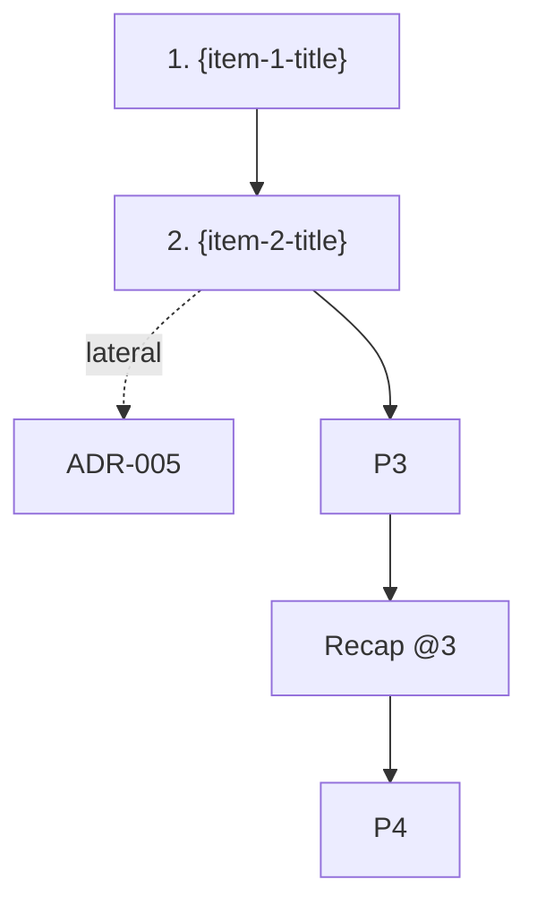

# Storytelling Export Mode


<!-- toc -->

- [When this loads](#when-this-loads)
- [Output structure](#output-structure)
- [Hybrid execution](#hybrid-execution)
- [Per-portion file template](#per-portion-file-template)
- [Index file template](#index-file-template)
- [Mode coverage in export](#mode-coverage-in-export)
- [Internal vs external links](#internal-vs-external-links)
- [Open-questions in export](#open-questions-in-export)
- [Refused operations during EXPLAIN_EXPORT](#refused-operations-during-explainexport)
- [Re-generation](#re-generation)

<!-- /toc -->

Loaded by `requirements/storytelling.md` (router) when `EXPLAIN_EXPORT=true`. Phases (E0-E5) and modes (presentation/review/onboarding/decision/socratic/change-impact) come from `storytelling-phases.md` and `storytelling-modes.md`; this module overrides only the output target (files instead of chat) and a few delivery rules.

## When this loads

`EXPLAIN_EXPORT=true` is set by the `generate.md` WHEN-rule on intent like `generate guide for X`, `make a README from X`, `export explain package`, `create training material from X`, `build onboarding doc set` — equivalents in any user language. Standard `generate.md` write-permission gates apply (user confirmation before writing files; no auto-approval flags unless explicitly requested).

## Output structure

Package directory: `{cypilot_path}/.cache/explain/packages/{slug}-{ISO-timestamp}/`
- `index.md` — entry point: title block, plan with file links, Mermaid navigation graph, wrap-up sections (Key Takeaways / Open Questions / Glossary / mode-specific extras)
- `portion-{NNN}-{kebab-slug}.md` — one file per portion. Sub-portions from proactive decomposition get suffixed numbers (`portion-003a-...`, `portion-003b-...`). Review-mode pairs use phase suffixes (`portion-003-presentation-...`, `portion-003-challenge-...`)
- `recap-{NNN}.md` — only if a Recap portion was emitted at this point in the plan
- `diagrams/portion-{NNN}.md` — per-portion Mermaid diagrams (only when Mermaid format chosen or Both; ASCII inline in the portion file otherwise)
- `open-questions.md` — only if buffer non-empty at end of generation (in pure-batch the user-driven buffer is usually empty; entries from interactive E1 Discovery persist)
- `glossary.md` — only if non-empty
- `key-takeaways.md` — always written, per plan item

## Hybrid execution

Phase E0 (pre-flight) and Phase E1 (Discovery) remain **interactive** in chat — invocation handling, mode/role/audience confirmation, plan approval. After plan approval, methodology switches to **batch generation**: portions constructed sequentially per the plan and written directly to files **without** per-portion navigation prompts in chat. Progress indicator emits as each file lands (`Writing portion 3 of 7…`). Final chat message announces package location and file count.

User MAY interrupt mid-batch with `stop` / `abort` — methodology halts, leaves whatever files were already written on disk, reports partial state. No checkpoint prompt — the package files themselves are the persisted state.

## Per-portion file template

````markdown
# Portion {N} of {N}: {plan-item}

> {one-line subtitle from input}

{body — same as chat portion body, ≤ resolved page-size, clickable Markdown source refs per Phase E3}

## Diagram

```mermaid
{diagram code}
```
(or fenced ASCII block; or omitted if Phase E4 step 1 chose text-only with an articulable reason)

## Sources

- [{source-1-display}]({source-1-link})
- [{source-2-display}]({source-2-link})

🎨 visualization: {text-only | text+diagram} — {reason}

---

**Navigation**:
- ⬅️ Previous: [{prev-title}](portion-{NNN-1}-{prev-slug}.md) (or `(none — first portion)`)
- ➡️ Next: [{next-title}](portion-{NNN+1}-{next-slug}.md) (or `(none — final portion)`)
- 🔄 Lateral: [{lateral-target}]({...}) — internal `.md` link OR external clickable ref per Lateral slot rules (omitted when `(no lateral candidates)`)
- 🔁 Recap: [Recap as of portion {N}](recap-{NNN}.md) (only if a Recap portion was emitted at this point)
- 🏁 Final summary: [index.md → Wrap-up](index.md#wrap-up)
````

## Index file template

````markdown
# Explain Package: {target-title}

| Mode | Role | Audience | Generated | Source |
|---|---|---|---|---|
| {mode} | {role} | {audience} | {ISO-date} | [{target-path}]({target-relative-link}) |

## Plan

1. [Portion 1 — {item-1-title}](portion-001-{slug}.md) — {one-line subtitle}
2. [Portion 2 — {item-2-title}](portion-002-{slug}.md) — {one-line subtitle}
…

## Navigation graph



## Wrap-up

### Key Takeaways
- … (with clickable refs)

### Open Questions ({K})
- (or "none")

### Glossary ({G})
- (or "none")

### Mode-specific extras
- onboarding → "Reading Roadmap" + "People to Know"
- decision → "Recommendation" + "Dissenting Opinions" + "Decision Criteria" + "Reversibility Note"
- change-impact → "Impact Map" + "Risk List" + "Migration Notes" (if any)
- presentation → no extras (Key Takeaways covers it)
````

## Mode coverage in export

All non-socratic modes produce the **same uniform package shape** (per-portion files + index + Mermaid graph + mode-specific extras in `index.md` wrap-up). This satisfies the router's Validation Checklist requirement that "package contains `index.md` + per-portion files" without per-mode exceptions. Mode-specific differences land in additional artifacts and wrap-up sections, NOT in skipping the per-portion files.

- `presentation` → multi-file package: index + per-portion files + Mermaid nav graph + Key Takeaways / Open Questions / Glossary / Bookmarks in wrap-up
- `onboarding` → same shape + wrap-up extras: Reading Roadmap + People to Know
- `decision` → same shape + wrap-up extras: Recommendation + Dissenting Opinions + Decision Criteria + Reversibility Note
- `change-impact` → same shape + wrap-up extras: Impact Map + Risk List + Migration Notes
- `review` → same shape (per-portion files for the two-portion-per-plan-item rhythm: each plan item produces one presentation file `portion-{NNN}-presentation-{slug}.md` and one challenge file `portion-{NNN}-challenge-{slug}.md`) **PLUS** an additional artifact-disposition file `review-comments-{slug}-{date}.md` with the ready-to-paste line-anchored review notes (per the review-mode artifact-disposition rules in `storytelling-preferences.md`). The comments file is in addition to, not in place of, the per-portion narrative — both are useful: the package is the hand-off-able review story; the comments file is the actionable review feedback.
- `socratic` → NOT exportable. Methodology MUST refuse with `Socratic mode is interactive (agent quizzes user); export to a static package would lose the quiz dynamic. Pick a different mode for export.` and stop without writing anything.

## Internal vs external links

- **External refs** (source input artifact + registered linked artifacts): clickable Markdown links per Phase E3, paths resolved relative to the package directory (e.g. `../../../requirements/auth-prd.md#310-authentication`). PR-target rule applies (PR-view URL for files-in-the-diff).
- **Internal links** (between portion files in the same package): relative paths within the package (e.g. `portion-002-data-model.md`, `recap-005.md`, `glossary.md`).

## Open-questions in export

Per the user-driven rule (Phase E3) the buffer fills only from user-asked questions. In pure-batch generation the user does not ask questions during portion writing, so the buffer typically stays empty and `open-questions.md` is omitted. Entries from interactive E1 Discovery questions persist into the file.

To avoid silently dropping audience-relevant gaps, methodology MAY emit a chat-only suggestion at the start of batch generation: `If you want a "questions reviewers might raise" file in the package, run a follow-up review-mode export against the same target.` Suggestion is informational only — methodology MUST NOT auto-generate gap entries.

## Refused operations during EXPLAIN_EXPORT

- Per-portion chat navigation prompts (the 6-slot Phase E2 nav block) MUST NOT be emitted; navigation lives in file footers
- Mid-session Wrap (Phase E5 trigger 2) is disabled — `stop` / `abort` halt batch generation and leave a partial package on disk; methodology does NOT prompt to "save a checkpoint" because the package files themselves are the persisted state

## Re-generation

Each export is a one-shot. The package directory is named with an ISO-timestamp to avoid clobbering. Incremental re-generation when the input changes is **out of scope for v1**; the user re-runs the export to produce a fresh package.
