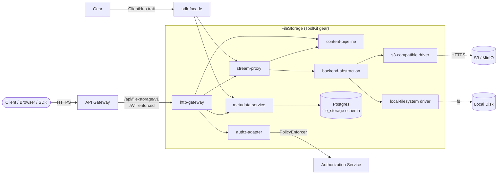
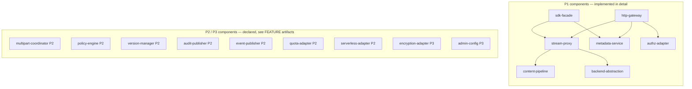
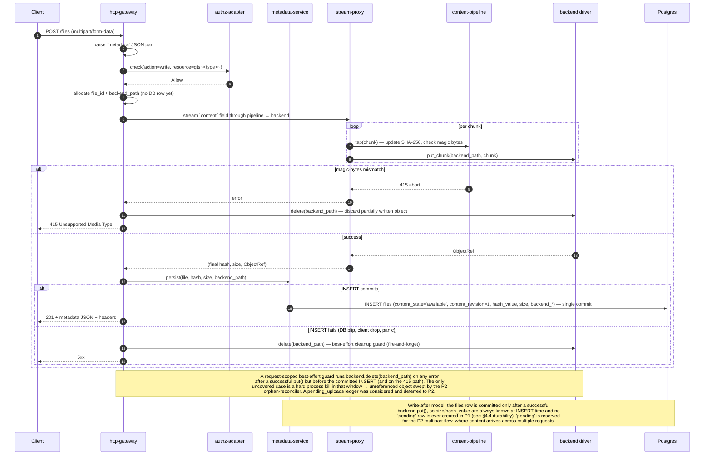
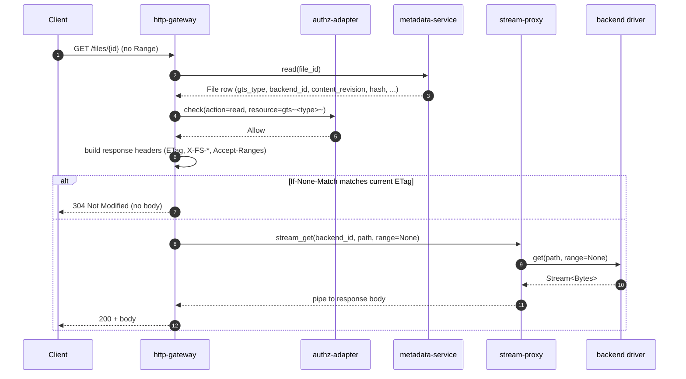
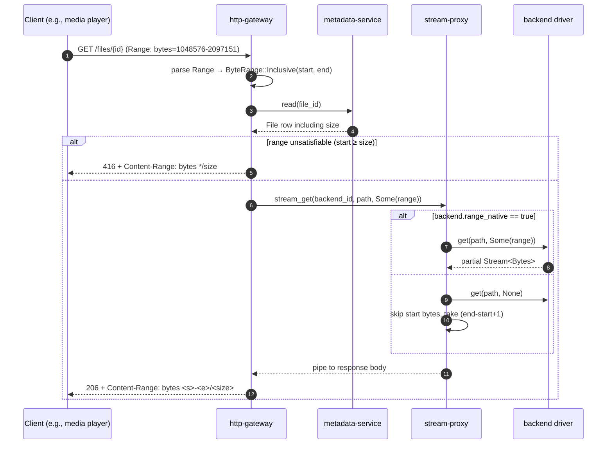
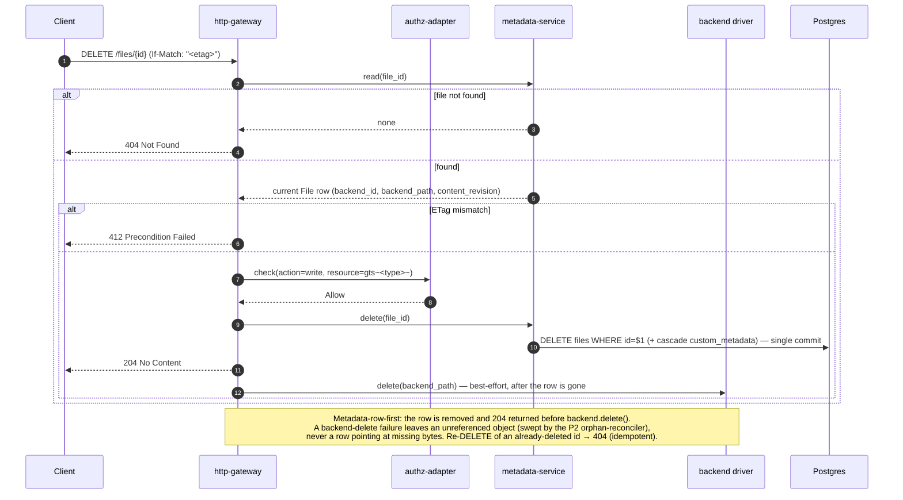
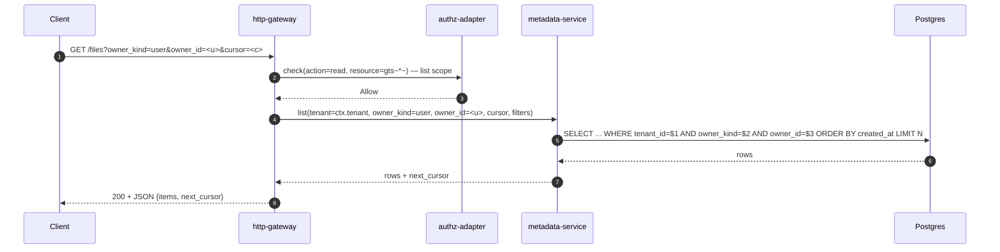

# Technical Design — FileStorage


<!-- toc -->

- [1. Architecture Overview](#1-architecture-overview)
  - [1.1 Architectural Vision](#11-architectural-vision)
  - [1.2 Architecture Drivers](#12-architecture-drivers)
  - [1.3 Architecture Layers](#13-architecture-layers)
- [2. Principles & Constraints](#2-principles--constraints)
  - [2.1 Design Principles](#21-design-principles)
  - [2.2 Constraints](#22-constraints)
- [3. Technical Architecture](#3-technical-architecture)
  - [3.1 Domain Model](#31-domain-model)
  - [3.2 Component Model](#32-component-model)
  - [3.3 API Contracts](#33-api-contracts)
  - [3.4 Internal Dependencies](#34-internal-dependencies)
  - [3.5 External Dependencies](#35-external-dependencies)
  - [3.6 Interactions & Sequences](#36-interactions--sequences)
  - [3.7 Database Schemas & Tables](#37-database-schemas--tables)
  - [3.8 Deployment Topology](#38-deployment-topology)
- [4. Additional Context](#4-additional-context)
  - [4.1 Random Read Access](#41-random-read-access)
  - [4.2 Hash & ETag Pipeline](#42-hash--etag-pipeline)
  - [4.3 Concurrency & Streaming Backpressure](#43-concurrency--streaming-backpressure)
  - [4.4 Quality Attribute Coverage](#44-quality-attribute-coverage)
- [5. Traceability](#5-traceability)

<!-- /toc -->

- [ ] `p1` - **ID**: `cpt-cf-file-storage-design-overview`
## 1. Architecture Overview

### 1.1 Architectural Vision

FileStorage is a tenant-aware, owner-aware file storage service for Gears. It owns the platform's content data
plane: every byte of every upload and every download flows through it (see
[ADR-0001](./ADR/0001-cpt-cf-file-storage-adr-proxy-content-traffic.md)). FileStorage sits between consumers
(Gears and the platform UI) and a pluggable layer of backend drivers (local filesystem, S3-compatible
object storage; more in later phases). Consumers never address backends directly — they talk to FileStorage over a
single REST surface (and its in-process SDK trait), and FileStorage talks to backends over a small abstract trait.

The P1 architecture is deliberately narrow:

- One ToolKit gear, in-process, consumed by other Gears through ClientHub
- One HTTP URL namespace — auth-required (`/api/file-storage/v1`). All requests are platform-JWT-enforced;
  FileStorage has no anonymous surface in P1
- Streaming I/O on the proxy path; no full-file buffering at the FileStorage layer regardless of file size
- One hash algorithm — SHA-256, computed on the streaming upload path (see
  [ADR-0002](./ADR/0002-cpt-cf-file-storage-adr-content-hash-selection.md)); the full configurable hash-policy surface
  is exposed from P1 with a locked allow-list of `["SHA-256"]`
- Static TOML backend configuration; runtime/DB configuration is P3
- One URL shape for files: `/files/{file_id_uuid}` (`GET`/`HEAD` only), served only on the auth-required prefix.
  FileStorage never issues signed URLs, time-limited URLs, anonymous URLs, or per-recipient links — all of that is
  part of the deferred sharing surface (see "Sharing boundary (P3)" below)

**Sharing boundary (P3).** Anonymous/public access, time-bounded URLs, named recipients, group targeting, per-link
download counters, and any other sharing primitives are out of P1/P2 scope and deferred to P3. The working name
for this future capability is "FileShare"; whether it ships as a separate Gear or as an extension of
FileStorage itself is **not decided here** and will be settled by a future ADR at the time the functionality is
implemented. FileStorage P1/P2 stores no sharing-related state, exposes no anonymous URL namespace, has no JWT-bypass
paths, and has no endpoints tied to that future decision.

P2 introduces multipart upload (with the tree-/streaming-hash work-out from ADR-0002), audit + events + quota + usage
outbound flows, file versioning under content-replace, backend migration (relocating bytes between backends without
rotating URLs), and the policy engine. P3 adds runtime BYOS backend
configuration, server-side encryption, read audit, and the sharing capability described above. These phases are
declared in the component model below with forward references to future FEATURE artifacts; their detailed designs
are deliberately out of scope for this document.

### 1.2 Architecture Drivers

#### Product Requirements

See [PRD.md](./PRD.md) §1 "Overview" and §1.3 "Goals":

- Unified storage for all Gears and platform users
- Tenant-scoped + principal-scoped ownership (`owner_kind ∈ {user, app}`, `tenant_id` mandatory)
- Persistent URLs that outlive provider-issued URLs (e.g., LLM Gateway media outputs)
- Pluggable backends without service rebuild

#### Functional Drivers (P1)

| PRD FR ID                                              | Design Response                                                                                                                                                          |
|--------------------------------------------------------|--------------------------------------------------------------------------------------------------------------------------------------------------------------------------|
| `cpt-cf-file-storage-fr-upload-file`                   | `POST /files` multipart streamed through `content-pipeline` (hash + magic-bytes) to selected `backend-abstraction` driver                                                |
| `cpt-cf-file-storage-fr-download-file`                 | `GET /files/{id}` streamed from `backend-abstraction` driver back through `stream-proxy`                                                                                 |
| `cpt-cf-file-storage-fr-delete-file`                   | `DELETE /files/{id}` (requires `If-Match`): **metadata-row-first** — the `files` row is deleted in a committed transaction and `204` is returned, *then* `backend.delete(backend_path)` runs best-effort; a backend-delete failure leaves only an unreferenced object swept by the P2 `orphan-reconciler` (never a row pointing at missing bytes). Idempotent: deleting an already-deleted `file_id` returns `404`. Sequence in §3.6 |
| `cpt-cf-file-storage-fr-get-metadata`                  | `GET /files/{id}` (content) and `HEAD /files/{id}` (headers only) read `files` + `files_custom_metadata` via `metadata-service`                                          |
| `cpt-cf-file-storage-fr-list-files`                    | `GET /files` with mandatory `owner_kind` filter; tenant-scoped DB query through `metadata-service`                                                                       |
| `cpt-cf-file-storage-fr-content-type-validation`       | First ~64 bytes of upload tapped by `content-pipeline` magic-bytes detector; mismatch aborts the stream with `415`                                                       |
| `cpt-cf-file-storage-fr-file-ownership`                | Columns `tenant_id`, `owner_kind`, `owner_id` on `files`; immutable except via P2 ownership transfer                                                                     |
| `cpt-cf-file-storage-fr-authorization`                 | `authz-adapter` calls platform PolicyEnforcer with `gts.cf.fstorage.file.type.v1~<gts_file_type>~` resource on every auth-required operation                             |
| `cpt-cf-file-storage-fr-tenant-boundary`               | DB queries scoped by `SecurityContext.tenant_id` via SecureConn; cross-tenant rows are invisible                                                                         |
| `cpt-cf-file-storage-fr-data-classification`           | No-op — FileStorage stores opaque bytes; classification is consumer concern                                                                                              |
| `cpt-cf-file-storage-fr-file-type-classification`      | `gts_file_type` column on `files`; format-validated on upload; included as resource attribute in every `authz-adapter` call                                              |
| `cpt-cf-file-storage-fr-metadata-storage`              | System columns + `files_custom_metadata` table; exposed as JSON on `GET` body and as `X-FS-*` headers on every response                                                  |
| `cpt-cf-file-storage-fr-update-metadata`               | `PATCH /files/{id}` with JSON Merge Patch on `metadata` part; metadata-only updates bump `metadata_revision`/`last_modified_at` and leave `content_revision`/ETag intact |
| `cpt-cf-file-storage-fr-retention-indefinite`          | No background purge in P1; files live until owner deletes                                                                                                                |
| `cpt-cf-file-storage-fr-backend-abstraction`           | `StorageBackend` async trait with capability sub-traits; P1 drivers: `local-filesystem`, `s3-compatible`                                                                 |
| `cpt-cf-file-storage-fr-backend-capabilities`          | `BackendCapabilities` struct emitted by each driver, exposed via `GET /storages`; P1 capability allow-list locked to no optional capabilities active                     |
| `cpt-cf-file-storage-fr-backend-config-source`         | TOML file loaded at gear startup → in-memory `BackendRegistry`; surfaced read-only via `/storages`                                                                     |
| `cpt-cf-file-storage-fr-rest-api`                      | Axum router rooted under `/api/file-storage/v1`; raw routes for content endpoints, OperationBuilder for JSON endpoints                                                   |
| `cpt-cf-file-storage-fr-range-requests`                | See §4.1 Random Read Access for the full mechanics                                                                                                                       |
| `cpt-cf-file-storage-fr-conditional-requests`          | Content-only `ETag` derived from `(file_id, content_revision)`; `If-Match`/`If-None-Match` enforced uniformly in `http-gateway` middleware                               |

#### NFR Allocation

| NFR ID                                          | Summary                                                              | Allocated To                                                                                                                              | Design Response                                                                                                                                                                                                                                                | Verification                                                                                                                                          |
|-------------------------------------------------|----------------------------------------------------------------------|-------------------------------------------------------------------------------------------------------------------------------------------|----------------------------------------------------------------------------------------------------------------------------------------------------------------------------------------------------------------------------------------------------------------|-------------------------------------------------------------------------------------------------------------------------------------------------------|
| `cpt-cf-file-storage-nfr-metadata-latency`      | `<25 ms` p95 metadata queries                                        | `cpt-cf-file-storage-component-metadata-service`, `cpt-cf-file-storage-component-http-gateway`                                            | Single-row Postgres lookup on PK; covering index on `(tenant_id, owner_kind, owner_id, created_at)`. No backend round-trip on `HEAD`/`GET /files/{id}` metadata path                                                                                            | Load test driving `HEAD /files/{id}` at expected p95 traffic; p95 latency captured by OpenTelemetry histogram on `http-gateway`                       |
| `cpt-cf-file-storage-nfr-transfer-latency`      | `<50 ms` fixed overhead p95 on content transfer                      | `cpt-cf-file-storage-component-stream-proxy`, `cpt-cf-file-storage-component-backend-abstraction`                                         | Streaming I/O end-to-end (axum `Body` ↔ `Stream<Bytes>` ↔ backend client); no full-file buffering. Range translated to backend-native range where supported                                                                                                    | Measure fixed delta between request arrival at FileStorage and first byte returned by backend; histogram per backend driver                           |
| `cpt-cf-file-storage-nfr-url-availability`      | URLs available for retention duration matching platform SLA          | `cpt-cf-file-storage-component-metadata-service`, `cpt-cf-file-storage-component-backend-abstraction`                                     | URLs are derived from `file_id` and remain valid as long as the file row exists; deleted files return `404`; ETag changes do not invalidate URLs (only their cached representations)                                                                            | Long-running soak: re-fetch a set of `file_id`s over the SLA window; verify no transient `5xx`/`404` for live files                                  |
| `cpt-cf-file-storage-nfr-durability`            | RPO=0 for committed writes; RTO ≤ 15 min                              | `cpt-cf-file-storage-component-metadata-service`, `cpt-cf-file-storage-component-backend-abstraction`                                     | DB row committed *after* backend `put()` returns success; backend durability is inherited from the chosen driver. A request-scoped **best-effort cleanup guard** fires `backend.delete(backend_path)` on any error between a successful `put()` and the committed `INSERT` (DB blip, client drop, panic), so the only residual leak is a hard process kill in that window — bounded and swept by the P2 `orphan-reconciler`. RTO covered by Postgres HA + gear restart procedures                                                                                       | Chaos test: kill gear mid-upload — partial uploads MUST NOT leave a committed row pointing to missing content; inject a post-`put()` DB failure and assert the backend object is cleaned up (no orphan)                                       |
| `cpt-cf-file-storage-nfr-scalability`           | ≥1000 concurrent operations/instance; linear horizontal scaling      | All P1 components — they are stateless except for the metadata DB                                                                         | No instance-local state in the request path; every instance can serve any file given the shared metadata DB and backend driver. Streaming I/O keeps **CPU and memory** bounded per request. The **bandwidth** dimension — the cost consciously accepted by ADR-0001 — is modeled separately in `cpt-cf-file-storage-nfr-bandwidth`                                                                  | Load test: scale N → 2N instances, verify near-2× throughput; per-instance concurrency target measured at saturation                                  |
| `cpt-cf-file-storage-nfr-bandwidth`             | Per-instance ingress+egress budget; full traffic transits FileStorage | `cpt-cf-file-storage-component-stream-proxy`, `cpt-cf-file-storage-component-backend-abstraction`, deployment topology                    | ADR-0001 routes every uploaded and downloaded byte through FileStorage, so per-instance bandwidth — not CPU/memory — is the binding constraint. P1 deployment budget: **target ≥ 2.5 GiB/s combined ingress+egress per instance** (≈ 1.25 GiB/s each way on a 25 GbE NIC, sized so the ≥1000 concurrent-ops target is bandwidth- rather than CPU-bound at typical media object sizes). Capacity = `ceil(peak aggregate transfer rate / per-instance budget)` instances; transfer load scales horizontally with the stateless replicas. Download caching is offloaded to the API-Gateway / CDN layer using the content-only `ETag`, `Cache-Control`, and `Vary` response headers FileStorage already emits, so repeat-read egress need not re-transit FileStorage | Load test: saturate a single instance's NIC with concurrent downloads, confirm it sustains the per-instance budget before CPU saturates; verify CDN/proxy serves conditional re-reads from cache (no FileStorage egress on `304`/cache hit) |

#### Key ADRs

| ADR ID                                                | Decision Summary                                                                                                                                                                                       |
|-------------------------------------------------------|--------------------------------------------------------------------------------------------------------------------------------------------------------------------------------------------------------|
| `cpt-cf-file-storage-adr-proxy-content-traffic`       | All content traffic transits FileStorage; backends never addressed directly by clients                                                                                                                 |
| `cpt-cf-file-storage-adr-content-hash-selection`      | P1 ships the full hash-selection API with allow-list locked to `["SHA-256"]`; P2 expands the allow-list to BLAKE3 + XXH3 alongside multipart upload                                                    |

### 1.3 Architecture Layers



| Layer          | Responsibility                                                                                                  | Technology                                                                       |
|----------------|-----------------------------------------------------------------------------------------------------------------|----------------------------------------------------------------------------------|
| API            | HTTP routing, request parsing, conditional-request and Range middleware, response shaping                       | axum, hyper, tower middleware                                                    |
| Application    | Orchestration: upload pipeline, download proxying, metadata CRUD, capability discovery                          | Rust async services (tokio); OperationBuilder for JSON endpoints                 |
| Domain         | File ownership, revision counters, ETag derivation, content state                                               | Rust structs + SeaORM entities                                                   |
| Infrastructure | Postgres metadata storage; backend drivers (local FS, S3-compatible); PolicyEnforcer client; TOML config loader | SeaORM + SecureORM + SecureConn (Postgres); `aws-sdk-s3`; `tokio::fs` |

## 2. Principles & Constraints

### 2.1 Design Principles

#### Backend opacity

- [ ] `p1` - **ID**: `cpt-cf-file-storage-principle-backend-opacity`

Backends are an internal implementation detail. No public API surface — REST, SDK, or otherwise — exposes
backend-addressable URLs, backend-native identifiers, or backend-specific error shapes. Clients learn at most that a
backend has certain *capabilities*, never *which* backend they are talking to.

**ADRs**: `cpt-cf-file-storage-adr-proxy-content-traffic`

#### Streaming over buffering

- [ ] `p1` - **ID**: `cpt-cf-file-storage-principle-streaming`

The proxy path moves bytes in chunks (axum `Body`/`Stream<Bytes>`) without holding whole files in memory. This applies
to uploads, downloads, and range requests. Magic-bytes detection and SHA-256 hashing are tap-like operations that
update on each chunk; they never block the chunk from continuing downstream.

**ADRs**: `cpt-cf-file-storage-adr-proxy-content-traffic`

#### Content-only content ETag

- [ ] `p1` - **ID**: `cpt-cf-file-storage-principle-content-only-etag`

ETag and hash are functions of the bytes only. Metadata updates change `metadata_revision` and `last_modified_at` but
not ETag or hash — keeping ETag a pure content cache-validator (so CDNs do not invalidate cached bytes on a
metadata-only change). Because ETag is deliberately content-only, `If-Match` on a metadata-only `PATCH` protects
against concurrent **content** writes but cannot detect concurrent **metadata** writes.

Rather than leave metadata writes silently last-write-wins, P1 exposes the metadata revision as its own conditional
validator: the `metadata_revision` is already on the wire as `X-FS-Metadata-Revision: <u64>`, and a metadata-only
`PATCH` MAY carry **`If-Match-Metadata: <u64>`**, matched against the current `metadata_revision` (mismatch → `412`).
The header is optional: absent, the write falls back to last-write-wins for back-compatibility; clients that store
real state in custom metadata (billing tags, classification, policy labels) opt in to lost-update protection. This
keeps the wire contract locked in P1 without composing it into ETag (which would defeat CDN caching on metadata-only
changes).

**ADRs**: `cpt-cf-file-storage-adr-content-hash-selection`

#### Capability discovery, not feature flags

- [ ] `p2` - **ID**: `cpt-cf-file-storage-principle-capabilities`

Optional features (versioning, multipart, encryption) are declared per backend as capabilities, not bolted on as
runtime flags. Clients query `/storages` and adapt. P1 declares the shape of capabilities but leaves all optional
capabilities inactive.

**ADRs**: `cpt-cf-file-storage-adr-content-hash-selection`

### 2.2 Constraints

#### ToolKit in-process gear

- [ ] `p1` - **ID**: `cpt-cf-file-storage-constraint-toolkit-gear`

FileStorage runs as an in-process ToolKit gear, registered via `#[toolkit::gear]`. Inter-gear callers use the
generated SDK trait via ClientHub. There is no out-of-process gRPC variant in P1; the OoP path is reserved as a P3
escape hatch if bandwidth or isolation pressures emerge from production traffic.

#### Postgres as the metadata store

- [ ] `p1` - **ID**: `cpt-cf-file-storage-constraint-postgres`

File metadata, custom metadata, and (P3) backend configurations are persisted in Postgres via SeaORM + SecureORM.
Tenant scoping happens through SecureConn — there is no direct un-scoped DB access from request handlers.

#### Configuration via static TOML in P1

- [ ] `p1` - **ID**: `cpt-cf-file-storage-constraint-toml-config`

Backend definitions in P1 are loaded from a static TOML file at gear startup. Changing the set of backends or
their credentials requires a restart. Runtime/DB-driven configuration with admin tooling is a P3 deliverable
(`cpt-cf-file-storage-fr-runtime-backends`).

## 3. Technical Architecture

### 3.1 Domain Model

**Technology**: Rust structs (`file-storage-sdk` crate) backed by SeaORM entities (`file-storage-infra` crate) per the
[ToolKit SDK layering guide](../../../docs/toolkit_unified_system/02_gear_layout_and_sdk_pattern.md).

**Location**: `gears/file-storage/file-storage-sdk/src/types.rs` (intended) for public types;
`gears/file-storage/file-storage/src/infra/entities/*.rs` for SeaORM entities.

**Core Entities**:

| Entity                | Description                                                                                                                                |
|-----------------------|--------------------------------------------------------------------------------------------------------------------------------------------|
| `File`                | Logical file: identity, tenant, owner, mime, gts type, content state, revisions, hash, timestamps                                          |
| `CustomMetadata`      | User-defined key-value pairs attached to a `File`; one row per `(file_id, key)`                                                            |
| `OwnerPrincipal`      | Tagged union `{User(UserId), App(GearId)}`; carried as `(owner_kind, owner_id)` on `File`                                                |
| `ContentState`        | Enum `{Pending, Available}`; in P1 every successful `POST /files` lands in `Available`. Pending exists only for P2 multipart pre-completion |
| `ETag`                | Opaque `String` (HTTP-quoted, base64url payload); derived from `(file_id, content_revision)`; **MUST NOT** equal `hash_value`               |
| `ByteRange`           | Parsed `Range` request: `Inclusive(start, end)`, `OpenEnded(start)`, `Suffix(length)`                                                       |
| `HashPolicy`          | Per-backend hash configuration: `default_algorithm`, `allowed_algorithms`, `selection_rules`. P1: locked to `["SHA-256"]`                   |
| `BackendCapabilities` | Per-backend feature flags: `versioning_native`, `multipart_native`, `encryption_native`, `range_native`, `presigned_url_internal`           |
| `BackendConfig`       | Declared instance: `id`, `kind`, `endpoint`, `credentials`, `capabilities`, `hash_policy`. Loaded from TOML in P1                          |

**Relationships**:

- `File` → `OwnerPrincipal` (composition; immutable except via P2 ownership transfer)
- `File` → `CustomMetadata` (1:N; cascade-deleted with the file)
- `File` → `BackendConfig` (reference by `backend_id`; immutable per file **in P1**, relaxed by the
  `backend-migrator` component (P2/P3; see PRD `cpt-cf-file-storage-fr-backend-migration`) — until then the backend that wrote the bytes also owns the
  version chain when versioning is on. Immutability is enforced at the service layer only, **not** as a DB constraint,
  so a future migrator can relocate non-versioned files without a schema change)
- `ETag` ← derived from `File.content_revision`
- `BackendCapabilities` ← embedded in `BackendConfig`; surfaced read-only via `GET /storages`

### 3.2 Component Model



#### `http-gateway`

- [ ] `p1` - **ID**: `cpt-cf-file-storage-component-http-gateway`

##### Why this component exists

The HTTP entry point. Owns route registration, security middleware, conditional-request/Range header parsing, and
error mapping to RFC 7807 Problem+JSON.

##### Responsibility scope

- Register the auth-required router `/api/file-storage/v1/*` with the platform `security_context_layer`
- Parse and validate HTTP-level inputs: `Content-Type` (must be `multipart/form-data` for create/update),
  `Range` header (parse to `ByteRange`), conditional headers, and the `?replace_content` flag on `PATCH` —
  rejecting with `400` when a `content` part and the flag disagree (part without flag, or flag without part)
- Enforce conditional-request semantics (return `304`, `412` as defined in `cpt-cf-file-storage-fr-conditional-requests`),
  including the optional `If-Match-Metadata` precondition on metadata-only `PATCH` (matched against `metadata_revision`)
- Own the **request-scoped best-effort cleanup guard**: on `POST /files`, fire `backend.delete(backend_path)` if any
  error occurs after a successful `put()` but before the `files` `INSERT` commits (and on the `415` abort path); on
  `DELETE /files/{id}`, issue `backend.delete(backend_path)` after the row is committed-deleted. Both are
  fire-and-forget — a failed backend delete degrades to an orphan reconciled in P2, never a row pointing at missing bytes
- Map domain errors to status codes + Problem+JSON bodies per `docs/toolkit_unified_system/05_errors_rfc9457.md`
- Populate response headers including `ETag`, `Accept-Ranges`, `Last-Modified`, all `X-FS-*` system metadata, and
  `X-FS-Meta-<key>` for custom metadata (with RFC 8187 encoding for non-ASCII values)
- Route content endpoints (`GET`/`HEAD /files/{id}`, `POST /files`, `PATCH /files/{id}`) through raw axum handlers
  that stream bodies; route JSON endpoints (`GET /files`, `GET /storages`, `GET /storages/{id}`) through
  OperationBuilder

##### Responsibility boundaries

Does not perform authorization decisions itself — delegates to `authz-adapter`. Does not parse `metadata` JSON
contents — passes the bytes to `metadata-service`. Does not own the streaming body — passes it to `stream-proxy`.

##### Related components

- `cpt-cf-file-storage-component-authz-adapter` — calls before every auth-required handler
- `cpt-cf-file-storage-component-metadata-service` — calls for metadata read/write
- `cpt-cf-file-storage-component-stream-proxy` — delegates content streaming to it
- `cpt-cf-file-storage-component-content-pipeline` — shares request-scoped state (declared mime, hash result) via
  `stream-proxy`

#### `stream-proxy`

- [ ] `p1` - **ID**: `cpt-cf-file-storage-component-stream-proxy`

##### Why this component exists

The data plane. Wires the byte path from HTTP body ↔ `content-pipeline` ↔ backend driver, in both upload and download
directions, without buffering the whole file at any point.

##### Responsibility scope

- **Upload path**: receive `axum::body::Body` of the `content` multipart field; tee chunks through
  `content-pipeline` (which updates SHA-256 and runs magic-bytes detection on the first chunks); forward chunks to the
  selected backend driver via `StorageBackend::put()`. On stream completion, emit final hash and the persisted
  `ObjectRef` from the driver
- **Download path**: invoke `StorageBackend::get(file.backend_path, range)` and pipe the returned `Stream<Bytes>` into
  the HTTP response body. Pass `ByteRange` through to backends that declare `range_native = true`; otherwise the
  driver's own range adapter applies (see §4.1)
- **Backpressure**: respect the slowest of (client, backend) by holding flow control on the stream; no internal
  queueing beyond the natural one-chunk lookahead
- **Cancellation**: if the client drops, the upstream backend operation is aborted (S3 SDK abort / fs handle drop)

##### Responsibility boundaries

Does not perform authorization, validation, or metadata persistence. Does not know about HTTP semantics — only `Body`
in and `Body` out. Does not decide which backend to use — that is `metadata-service` (selects by `file.backend_id`).

##### Related components

- `cpt-cf-file-storage-component-content-pipeline` — taps the upload stream
- `cpt-cf-file-storage-component-backend-abstraction` — calls drivers for put/get/delete/stat
- `cpt-cf-file-storage-component-http-gateway` — its byte-source and byte-sink

#### `content-pipeline`

- [ ] `p1` - **ID**: `cpt-cf-file-storage-component-content-pipeline`

##### Why this component exists

Centralizes the two streaming taps that *must* run on every upload: SHA-256 hashing and mime detection from magic
bytes. Implementing them as a single composable tap on a `Stream<Bytes>` avoids re-reading the body.

##### Responsibility scope

- **SHA-256 hasher**: `sha2::Sha256` updated on every chunk; finalized hash returned at end-of-stream. Algorithm tag
  is `"SHA-256"` per the locked P1 allow-list (`cpt-cf-file-storage-adr-content-hash-selection`)
- **Magic-bytes detector**: accumulates a bounded prefix buffer (default 64 bytes — comfortable headroom over the
  longest currently-known magic-byte sequence). When the buffer is large enough, runs a synchronous mime sniff (e.g.,
  `infer` crate or hand-rolled lookup) and compares against the declared `mime_type` from the multipart `metadata`
  field. Mismatch → abort the stream with `415 Unsupported Media Type` (returned via the `stream-proxy` to the
  `http-gateway`)
- **No buffering of subsequent bytes**: once the magic-bytes check passes, chunks pass through unchanged

##### Responsibility boundaries

Does not maintain state across requests. Does not own backend selection. Does not transform bytes — only inspects.

##### Related components

- `cpt-cf-file-storage-component-stream-proxy` — invokes the pipeline per chunk

#### `metadata-service`

- [ ] `p1` - **ID**: `cpt-cf-file-storage-component-metadata-service`

##### Why this component exists

Owns the `files` and `files_custom_metadata` tables. Every request that needs to know "does this file exist, who owns
it, what is its current state?" goes through here. Owns ETag derivation and revision-counter management.

##### Responsibility scope

- CRUD on `files` rows (create on `POST /files`; read on `GET`/`HEAD`/`PATCH`/`DELETE`; update on `PATCH`; delete on
  `DELETE /files/{id}`)
- CRUD on `files_custom_metadata` (JSON Merge Patch applied row-by-row)
- Derive the opaque `ETag` on the fly from `(file_id, content_revision)` per §4.2 — there is no separate persisted
  ETag column; `content_revision` is the only stored input
- Set `content_revision` on content writes: `POST /files` (create) initializes it to `1`; each content-replacing
  `PATCH`/multipart `complete` bumps it. Bump `metadata_revision` on every successful write
- Bump `last_modified_at` on every successful write
- Enforce tenant boundary via SecureConn — every query/mutation passes through the request's `SecurityContext`
- Tenant + owner filter on `GET /files`; pagination with stable cursor; index-backed by
  `(tenant_id, owner_kind, owner_id, created_at)`
- Reject PRD-defined constraints at this layer when they are not enforceable as DB constraints (e.g., GTS format
  validation regex, tenant policy delta in P2)

##### Responsibility boundaries

Does not call backend drivers itself. Does not perform authorization checks. Does not stream content.

##### Related components

- `cpt-cf-file-storage-component-http-gateway` — primary caller
- `cpt-cf-file-storage-component-sdk-facade` — exposes the same operations to in-process gear consumers

#### `backend-abstraction`

- [ ] `p1` - **ID**: `cpt-cf-file-storage-component-backend-abstraction`

##### Why this component exists

The single seam between FileStorage and any concrete storage technology. The trait surface is small and async; each
optional capability (multipart, versioning, encryption) is a separate sub-trait that drivers opt into.

##### Responsibility scope

- Define the `StorageBackend` async trait: `put`, `get(range)`, `delete`, `stat`, `capabilities`
- Define capability sub-traits: `MultipartCapable`, `VersioningCapable`, `EncryptionCapable` (the last two are P2/P3
  use, but the trait shapes are declared from P1 so consumers can downcast/probe)
- Maintain the `BackendRegistry` — in-process map of `backend_id → Arc<dyn StorageBackend>` populated at startup from
  the TOML config
- P1 drivers:
  - `local-filesystem` — `tokio::fs` reads/writes under a configured root directory; native Range via `seek + take`
  - `s3-compatible` — `aws-sdk-s3` (works against AWS S3, MinIO, Backblaze B2, Wasabi, etc.); native Range via
    backend `GetObject` Range header
- Reject any operation that depends on a capability the configured backend has not declared (`409 Conflict` /
  `501 Not Implemented` depending on context)

##### Responsibility boundaries

Drivers never see HTTP, never see `SecurityContext`. The trait works in bytes and paths only — domain knowledge stays
above the trait. Drivers MAY use internal-only capabilities (`presigned_url_internal`) for backend-to-backend
replication or migration tooling, but those capabilities are **never** surfaced through the public capability
discovery endpoint and are unreachable from the SDK-facing call site.

##### Related components

- `cpt-cf-file-storage-component-stream-proxy` — main caller for content I/O
- `cpt-cf-file-storage-component-metadata-service` — calls `stat` during reconciliation paths

#### `authz-adapter`

- [ ] `p1` - **ID**: `cpt-cf-file-storage-component-authz-adapter`

##### Why this component exists

Wraps the platform PolicyEnforcer with FileStorage-specific request shaping: every check carries the file's GTS type
in the resource context so that the Authorization Service can apply per-type policies.

##### Responsibility scope

- For each auth-required operation, build a `PolicyRequest` with:
  - `subject = SecurityContext.principal` (user or service identity)
  - `action ∈ {read, write, delete, ownership.transfer}` mapped from the HTTP method + endpoint
  - `resource = gts.cf.fstorage.file.type.v1~<gts_file_type>~<file_id>`
- Call `PolicyEnforcer::check` (in-process via ClientHub)
- Convert `Deny` decisions to `403 Forbidden` Problem+JSON; `Allow` decisions are silent

##### Responsibility boundaries

Does not cache decisions in P1 (each request is checked fresh). Does not implement role-based shortcuts — it asks the
AuthZ service every time.

##### Related components

- `cpt-cf-file-storage-component-http-gateway` — calls before dispatch on auth-required routes
- `cpt-cf-file-storage-component-metadata-service` — provides `gts_file_type` for the resource context

#### `sdk-facade`

- [ ] `p1` - **ID**: `cpt-cf-file-storage-component-sdk-facade`

##### Why this component exists

In-process SDK trait for other Gears (LLM Gateway, Reporting, etc.). Mirrors the REST API one-to-one in
domain types so that callers see the same logical operations regardless of whether they go through HTTP or
ClientHub.

##### Responsibility scope

- Expose a Rust trait (`FileStorageClient`) in `file-storage-sdk` covering: `create_file`, `download_file` (returns
  `Stream<Bytes>`), `download_range`, `head_file`, `update_metadata`, `delete_file`, `list_files`, `list_storages`,
  `get_storage`
- Internally call `metadata-service` and `stream-proxy` directly (no HTTP round-trip)
- Carry `SecurityContext` from the calling gear's request context; authorization runs through the same
  `authz-adapter`

##### Responsibility boundaries

Does not duplicate the HTTP-layer header parsing. Does not expose backend types — only the same domain types as the
REST API.

##### Related components

- `cpt-cf-file-storage-component-metadata-service`
- `cpt-cf-file-storage-component-stream-proxy`
- `cpt-cf-file-storage-component-authz-adapter`

#### P2 / P3 components — declared only

The following components are declared so that traceability from PRD FRs is preserved, and so that callers can see the
intended decomposition. Their detailed designs live in P2/P3 FEATURE artifacts (not yet authored).

| Component (`cpt-cf-file-storage-component-…`)         | Phase | One-line responsibility                                                                                                  | Forward reference                                                                              |
|-------------------------------------------------------|-------|--------------------------------------------------------------------------------------------------------------------------|------------------------------------------------------------------------------------------------|
| `multipart-coordinator`                               | P2    | Owns the multipart-upload lifecycle (initiate / part / complete / abort) and the per-part hash combiner from ADR-0002    | PRD `cpt-cf-file-storage-fr-multipart-upload`                                                  |
| `policy-engine`                                       | P2    | Evaluates tenant/user policies (allowed types, size limits, custom-metadata limits)                                      | PRD `cpt-cf-file-storage-fr-allowed-types-policy`, `…fr-size-limits-policy`                    |
| `version-manager`                                     | P2    | Owns the file-versioning lifecycle on versioning-capable backends; soft-delete markers; restore                          | PRD `cpt-cf-file-storage-fr-file-versioning`                                                   |
| `audit-publisher`                                     | P2    | Transactional outbox writer + async worker that drains to the platform audit sink                                        | PRD `cpt-cf-file-storage-fr-audit-trail`                                                       |
| `event-publisher`                                     | P2    | EventBroker emitter for upload/update/delete events, gated by owner policy                                               | PRD `cpt-cf-file-storage-fr-file-events`                                                       |
| `quota-adapter`                                       | P2    | Synchronous quota check before storage-consuming operations; usage reports asynchronously                                | PRD `cpt-cf-file-storage-fr-storage-quota`, `…fr-usage-reporting`                              |
| `serverless-adapter`                                  | P2    | Subscribes to owner-deletion events; invokes the configured Serverless Runtime workflow per owner                        | PRD `cpt-cf-file-storage-fr-owner-deletion`                                                    |
| `orphan-reconciler`                                   | P2    | Scheduled background task that reconciles `files` rows against backend object existence and aborts abandoned multipart sessions; emits audit per disposition | PRD `cpt-cf-file-storage-fr-orphan-reconciliation`                                             |
| `backend-migrator`                                    | P2    | Relocates a file's bytes between backends (cost-tier moves, backend deprecation, residency, rebalancing, DR) without rotating the `/files/{id}` URL; flips the service-layer `backend_id`-immutability for non-versioned files | PRD `cpt-cf-file-storage-fr-backend-migration`                                                 |
| `encryption-adapter`                                  | P3    | Manages server-side encryption parameters and key handles per backend                                                    | PRD `cpt-cf-file-storage-fr-file-encryption`                                                   |
| `admin-config`                                        | P3    | DB-backed runtime backend management (CRUD on backend configs) with credential rotation                                  | PRD `cpt-cf-file-storage-fr-runtime-backends`                                                  |

##### Multipart upload — deferred to P2 (no P1 wire commitment)

The detailed multipart contract is **owned by the P2 FEATURE for `multipart-coordinator`**
(`cpt-cf-file-storage-fr-multipart-upload`) and is **not designed here**. The P2 endpoint surface is only *sketched*
in api.md (`POST /files/multipart` initiate → client uploads `.../parts/{n}` → `.../complete` / `.../abort`) — a
**client-driven** part model consistent with `migration.sql`'s `multipart_uploads` / `multipart_upload_parts` tables.
The detailed semantics (part-size rules, concurrency, resumability, idempotency, per-part hash carry-over for BLAKE3
tree-mode, error codes) are deferred to that FEATURE. P1 leaves `capabilities.multipart_native` declared on
`GET /storages` but inactive.

To keep the P1 surface forward-compatible without binding the P2 shape, only these invariants are recorded:

- the initiation envelope reuses the single-shot `POST /files` file-metadata document (see §3.3) — no new
  metadata schema;
- the effective hash algorithm is bounded by the backend's `allowed_algorithms`
  (`cpt-cf-file-storage-adr-content-hash-selection`) exactly as for single-shot upload;
- capability discovery via `GET /storages` is sufficient for a client to learn whether a backend supports
  native multipart — no separate negotiation endpoint is needed in P1.

> An earlier draft specified a **server-authoritative** parts plan (server returns `parts[]` the client must use
> verbatim, plus a `concurrency` directive). That is **not adopted**: it contradicts the client-driven `.../parts/{n}`
> model in api.md and the dominant S3 idiom. Concrete request/response shapes are left to the P2 FEATURE so reviewers
> approving this PR are not implicitly ratifying them.

### 3.3 API Contracts

- [ ] `p1` - **ID**: `cpt-cf-file-storage-interface-api-contracts`

The full HTTP surface — endpoint list, multipart envelope shape, conditional headers, Range semantics, response header
schema, status codes — is documented in **[api.md](./api.md)**. The summary:

- **Technology**: REST (axum + OperationBuilder for JSON), no GraphQL, no gRPC. Public API contract versioned per
  `cpt-cf-file-storage-interface-rest-api`
- **Auth-required base**: `/api/file-storage/v1` — `POST /files`, `PATCH /files/{id}`, `GET/HEAD /files/{id}`,
  `DELETE /files/{id}`, `GET /files`, `GET /storages`, `GET /storages/{storage_id}`. P1 has no anonymous surface
- **Create / update body**: `multipart/form-data` with `metadata` (`application/json`, required on `POST`, optional
  on `PATCH`) and `content` (binary, required on `POST`, optional on `PATCH`). `metadata` MUST precede `content` to let
  the server route content through the right pipeline (declared mime informs the magic-bytes check)
- **Explicit content-replace intent on `PATCH`**: content replacement is full-file (`PUT`-style) semantics, not a
  partial patch, so a `PATCH` carrying a `content` part is accepted only with the `?replace_content=true` query flag.
  A `content` part without the flag — and the flag without a `content` part — are both rejected with `400`. This
  prevents silent content mutation when a client accidentally forwards a `content` part (which `If-Match` would not
  catch, since the current content ETag still matches at request time). Metadata-only `PATCH` needs no flag
- **Conditional headers**: `If-Match` required on `PATCH`/`DELETE`; `If-Match` and `If-None-Match` optional on
  `GET`/`HEAD`. ETag is `(file_id, content_revision)`-derived and content-only. `If-Match-Metadata: <u64>` is an
  optional metadata-concurrency validator on metadata-only `PATCH`, matched against `metadata_revision` (mismatch →
  `412`); absent → last-write-wins (see `cpt-cf-file-storage-principle-content-only-etag`)
- **Range**: full `bytes=` syntax supported; `Accept-Ranges: bytes` advertised on every download response; `HEAD`
  ignores `Range` and returns full-file headers. See §4.1 for backend translation rules
- **Custom metadata in headers**: one `X-FS-Meta-<key>` per pair; non-ASCII values use RFC 8187
  `*=UTF-8''<percent-encoded>` form

### 3.4 Internal Dependencies

| Dependency Gear                     | Interface Used                                                              | Purpose                                                                                                   |
|---------------------------------------|-----------------------------------------------------------------------------|-----------------------------------------------------------------------------------------------------------|
| ToolKit Framework                      | `#[toolkit::gear]` lifecycle; ClientHub typed registry                     | Gear registration; in-process SDK distribution                                                          |
| Platform Security                     | `security_context_layer` middleware + `SecurityContext` extractor           | Tenant + principal resolution on auth-required routes                                                     |
| Platform Authorization (PolicyEnforcer)| In-process SDK trait                                                       | Per-operation access decisions on `gts.cf.fstorage.file.type.v1~` resources                                |
| SecureORM / SecureConn (`db-runner`)  | SeaORM with tenant-scoped connection wrapper                                | Tenant-isolated DB access; all queries scoped by `SecurityContext.tenant_id`                              |
| Platform Errors (RFC 9457)            | `DomainError → Problem` mapping (`05_errors_rfc9457.md`)                    | Uniform Problem+JSON responses                                                                            |
| Types Registry SDK (P2)               | SDK trait (forward-ref)                                                     | Validate that the supplied `gts_file_type` is a real registered type (P1 falls back to format-regex only) |

**Dependency Rules**:
- No circular dependencies (FileStorage has no upstream Gear dependencies in P1)
- All inter-gear communication is via SDK traits, not internal types
- `SecurityContext` is propagated on every in-process call

### 3.5 External Dependencies

#### PostgreSQL

- **Contract**: implicit; uses platform DB connection pool — not a tracked external contract
- **Purpose**: Persist `files`, `files_custom_metadata`, and (P3) `storage_backends_runtime`. Schema-isolated under
  `file_storage` schema in the shared cluster
- **Interaction**: SeaORM + SecureORM through `db-runner` per `docs/toolkit_unified_system/11_database_patterns.md`.
  All connections are `SecureConn` and carry `tenant_id` for row-level scoping

#### Storage backends (drivers)

- **Local Filesystem**
  - **Purpose**: P1 reference driver and test fixture; serves files from a configured root
  - **Interaction**: `tokio::fs` async file I/O; native range reads via `AsyncSeekExt::seek` + `AsyncReadExt::take`
- **S3-Compatible Object Storage** (AWS S3, MinIO, Backblaze B2, Wasabi, etc.)
  - **Purpose**: P1 reference driver for production deployments
  - **Interaction**: `aws-sdk-s3`; native multipart (P2), native Range, optional server-side encryption (P3),
    optional versioning (P2)

### 3.6 Interactions & Sequences

#### Upload (P1, single-shot)

**ID**: `cpt-cf-file-storage-seq-upload-single-shot`

**Use cases**: `cpt-cf-file-storage-usecase-upload`

**Actors**: `cpt-cf-file-storage-actor-platform-user`, `cpt-cf-file-storage-actor-cf-gears`



#### Download — full file (P1)

**ID**: `cpt-cf-file-storage-seq-download-full`

**Use cases**: `cpt-cf-file-storage-usecase-fetch-media`



#### Download — range (P1)

**ID**: `cpt-cf-file-storage-seq-download-range`

**Use cases**: `cpt-cf-file-storage-usecase-fetch-media`



#### Metadata-only PATCH (P1)

**ID**: `cpt-cf-file-storage-seq-metadata-patch`

```mermaid
sequenceDiagram
    autonumber
    participant C as Client
    participant HGW as http-gateway
    participant AZ as authz-adapter
    participant MS as metadata-service
    participant DB as Postgres

    C->>HGW: PATCH /files/{id} (multipart: metadata only,<br/>If-Match: "<etag>", If-Match-Metadata: <rev> optional)
    HGW->>MS: read(file_id)
    MS-->>HGW: current File row (incl. metadata_revision)
    alt If-Match (ETag) mismatch
        HGW-->>C: 412 Precondition Failed
    else If-Match-Metadata present and != current metadata_revision
        HGW-->>C: 412 Precondition Failed
    else
        HGW->>AZ: check(action=write, resource=gts~<type>~)
        AZ-->>HGW: Allow
        HGW->>MS: apply_merge_patch(file_id, json)
        MS->>DB: UPDATE files SET ...; UPSERT files_custom_metadata
        Note over MS,DB: bump metadata_revision, last_modified_at;<br/>do NOT bump content_revision or ETag
        HGW-->>C: 200 + new metadata JSON + headers (ETag unchanged, X-FS-Metadata-Revision bumped)
    end
    Note over C,HGW: If-Match-Metadata is optional; absent → last-write-wins (back-compat).<br/>Present → lost-update protection keyed on metadata_revision (already emitted as X-FS-Metadata-Revision).
```

#### Delete (P1)

**ID**: `cpt-cf-file-storage-seq-delete`

**Use cases**: `cpt-cf-file-storage-usecase-delete-file`



#### List files (P1)

**ID**: `cpt-cf-file-storage-seq-list-files`



### 3.7 Database Schemas & Tables

- [ ] `p1` - **ID**: `cpt-cf-file-storage-db-overview`

**Schema**: `file_storage` in the shared Postgres cluster. SeaORM entities under
`gears/file-storage/file-storage/src/infra/entities/`. Migrations run through `db-runner` per
`docs/toolkit_unified_system/11_database_patterns.md`.

#### Table: `files`

**ID**: `cpt-cf-file-storage-dbtable-files`

**Schema**:

| Column                   | Type                                       | Description                                                                  |
|--------------------------|--------------------------------------------|------------------------------------------------------------------------------|
| `file_id`                | `uuid`                                     | Primary key                                                                  |
| `tenant_id`              | `uuid`                                     | Tenant scope; immutable                                                      |
| `owner_kind`             | `text` (`'user'` \| `'app'`)               | Owner principal kind                                                         |
| `owner_id`               | `uuid`                                     | Owner principal identifier                                                   |
| `name`                   | `text`                                     | Original upload name                                                         |
| `mime_type`              | `text`                                     | Declared & validated mime                                                    |
| `gts_file_type`          | `text`                                     | GTS file-type classifier; immutable                                          |
| `size`                   | `bigint`                                   | Content size in bytes                                                        |
| `content_revision`       | `bigint`                                   | Monotonic; bumped on content writes                                          |
| `metadata_revision`      | `bigint`                                   | Monotonic; bumped on every write                                             |
| `hash_algorithm`         | `text`                                     | P1: `'SHA-256'` only                                                         |
| `hash_value`             | `bytea`                                    | 32-byte SHA-256 digest of the content                                        |
| `content_state`          | `text` (`'pending'` \| `'available'`)      | `'pending'` only for P2 multipart pre-completion; P1 always `'available'`    |
| `backend_id`             | `text`                                     | Identifier of the `BackendConfig` that owns the bytes (TOML in P1)           |
| `backend_path`           | `text`                                     | Opaque path within the backend; format is per-driver                         |
| `created_at`             | `timestamptz`                              | Creation time; immutable                                                     |
| `last_modified_at`       | `timestamptz`                              | Last successful write (content or metadata)                                  |

**PK**: `file_id`

**Constraints**:
- `NOT NULL` on every column above
- `tenant_id` immutable (enforced at the service layer; no DB trigger)
- `(owner_kind, owner_id)` immutable except by `version-manager` (P2) and `serverless-adapter` (P2)
- `backend_id` immutable per file in P1 (enforced at the service layer; no DB constraint), relaxed for non-versioned
  files by `backend-migrator` (P2) — see `cpt-cf-file-storage-fr-backend-migration`

**Indexes**:
- `PRIMARY KEY (file_id)`
- `(tenant_id, owner_kind, owner_id, created_at DESC)` — covers `GET /files` listing
- `(tenant_id, gts_file_type)` — supports per-type queries

**Additional info**: Soft-delete markers in P2 are not implemented as a separate column; they live in
`file_versions` (declared in P2 FEATURE). For P1 there is no version history table.

#### Table: `files_custom_metadata`

**ID**: `cpt-cf-file-storage-dbtable-files-custom-metadata`

**Schema**:

| Column     | Type            | Description                                          |
|------------|-----------------|------------------------------------------------------|
| `file_id`  | `uuid`          | FK → `files(file_id)` ON DELETE CASCADE              |
| `key`      | `text`          | Custom metadata key                                  |
| `value`    | `text`          | Custom metadata value (UTF-8)                        |
| `set_at`   | `timestamptz`   | Last set timestamp; updated on UPSERT                |

**PK**: `(file_id, key)`

**Constraints**: `NOT NULL` on all columns; `value` length and per-file count limits are enforced at the service layer
in P2 (`cpt-cf-file-storage-fr-metadata-limits`); in P1 only sanity limits apply

**Additional info**: `ON DELETE CASCADE` so that deleting a `files` row removes its custom metadata automatically.

#### P2 / P3 tables — declared only

| Table                              | Phase | Purpose                                                                                  | Forward reference                                                |
|------------------------------------|-------|------------------------------------------------------------------------------------------|------------------------------------------------------------------|
| `multipart_uploads`                | P2    | In-flight multipart sessions: `upload_id`, `file_id`, parts list with per-part hashes    | `cpt-cf-file-storage-fr-multipart-upload`                        |
| `file_versions`                    | P2    | Per-file backend version pointers; soft-delete markers                                   | `cpt-cf-file-storage-fr-file-versioning`                         |
| `idempotency_keys`                 | P2    | Owner-scoped idempotency for `POST /files`                                               | `cpt-cf-file-storage-fr-upload-idempotency`                      |
| `audit_outbox`                     | P2    | Transactional-outbox rows drained by `audit-publisher` to the audit sink                 | `cpt-cf-file-storage-fr-audit-trail`                             |
| `events_outbox`                    | P2    | Outbox for EventBroker file-write events                                                 | `cpt-cf-file-storage-fr-file-events`                             |
| `policies`                         | P2    | Tenant + user policy definitions                                                         | `cpt-cf-file-storage-fr-allowed-types-policy`, etc.              |
| `retention_rules`                  | P2    | Auto-expiration definitions                                                              | `cpt-cf-file-storage-fr-retention-policies`                      |
| `storage_backends_runtime`         | P3    | DB-resident backend configuration that supersedes the P1 TOML file                       | `cpt-cf-file-storage-fr-runtime-backends`                        |

### 3.8 Deployment Topology

- [ ] `p1` - **ID**: `cpt-cf-file-storage-topology-overview`

FileStorage is deployed as part of the Gears modular monolith — one binary that hosts FileStorage alongside other
ToolKit gears registered in `gears-example-server` (or the production server crate). The relevant deployment-time
arrangements:

- **Process**: in-process with other ToolKit gears. No separate FileStorage binary in P1
- **Scaling**: horizontal at the platform level — each replica embeds its own FileStorage instance. There is no
  FileStorage-internal coordination state (no leader election, no in-memory caches that need to be coherent across
  replicas). Postgres is the shared coordination point
- **API Gateway routing**:
  - `/api/file-storage/v1/*` → JWT-enforced → forwarded to a FileStorage instance
  - Rate limiting and abuse protection (CIDR / fingerprinting) is the API Gateway's responsibility
- **Backend reachability**: every FileStorage replica must be able to reach every configured backend (S3 endpoint /
  local filesystem mount). For `local-filesystem`, the same physical (or networked) filesystem MUST be mounted on every
  replica; for `s3-compatible`, every replica must have network access and credentials. Credentials live in environment
  variables / mounted secret files referenced from the TOML config
- **Metadata DB**: shared Postgres cluster with the platform; `file_storage` schema; migrations applied at startup by
  one elected replica (`db-runner` handles election). Connection pooling per-replica via SeaORM defaults
- **Bandwidth escape hatch for ADR-0001 (future).** The cost ADR-0001 accepts (`cpt-cf-file-storage-nfr-bandwidth`) is
  absorbed by this same stateless-replica model — there is **no** plan to extract `stream-proxy` into a thin
  byte-mover data-plane tier. If byte traffic must be moved closer to a heavy consumer or to the edge, the unit of
  relocation is a **full FileStorage instance** (the entire stack — `http-gateway` → `metadata-service` →
  `stream-proxy` → backend drivers), deployed as a co-located sidecar that connects to the **shared/remote metadata
  Postgres** and, in the future, runs its own caching configuration. Such an instance serves `POST`/`GET /files/{id}`
  end-to-end exactly as a central replica does (auth → resolve `backend_path` → stream ↔ backend → commit the row in
  the shared DB). Because every replica is already stateless and any instance can serve any file, this needs **no
  wire-contract change, no two-phase upload, and no trait extraction** — it is a deployment/configuration change, not
  an architectural one. Download egress, the dominant cost, is additionally offloaded to the API-Gateway/CDN layer via
  the content-only `ETag`/`Cache-Control`/`Vary` headers (`cpt-cf-file-storage-nfr-bandwidth`). Inter-gear callers
  reach such a standalone/co-located instance via the P3 out-of-process gRPC SDK variant noted in
  `cpt-cf-file-storage-constraint-toolkit-gear` — the same escape hatch, viewed from the caller side

## 4. Additional Context

### 4.1 Random Read Access

- [ ] `p1` - **ID**: `cpt-cf-file-storage-design-random-read-access`

This section is the technical realization of PRD's `cpt-cf-file-storage-fr-range-requests`. The PRD requires that any
download channel must support arbitrary byte-range access. The implementation lives in `http-gateway` (parsing +
response shape), `stream-proxy` (translation to backend), and the backend drivers (native range or fallback).

**Range parsing (in `http-gateway`).** On every incoming `GET /files/{id}` the gateway inspects the `Range` header. Supported forms (RFC 7233 §2.1):

- `bytes=<start>-<end>` → `ByteRange::Inclusive(start, end)`
- `bytes=<start>-` → `ByteRange::OpenEnded(start)` — to end of file
- `bytes=-<suffix-length>` → `ByteRange::Suffix(suffix_length)` — last N bytes

**Unparseable `Range` headers.** A syntactically invalid / unparseable `Range` header (garbage value, unknown unit,
malformed range-set) is **ignored** per RFC 7233 §3.1: the gateway serves `200 OK` with the full body, exactly as if no
`Range` had been sent. The `416` path is reserved for headers that parse cleanly but cannot be satisfied against the
file's `size` (see below). This avoids surfacing an unexpected `416` to clients (browsers, `curl`, `aria2`) that never
intended a range request.

**Multiple ranges.** RFC 7233 §4.1 permits only two responses to a multi-range request (`bytes=0-99,200-299`): the full
representation (`200`), or a `multipart/byteranges` document. P1 chooses `200` (full body, no `Content-Range`) for
simplicity — it is spec-compliant, trivial to implement, and never mislabels the payload. (A "coalesced `206`" spanning
the union of the ranges is **not** RFC-conformant — it returns bytes the client did not request under an incorrect
`Content-Range` — and is explicitly not used.) `multipart/byteranges` is deferred; if introduced later it is a
backward-compatible upgrade from the `200` fallback.

**Satisfiability check (single range).** Once the gateway has the file's `size` from `metadata-service`, it computes the
resolved range:

- `Inclusive(s, e)`: unsatisfiable if `s ≥ size`. End is clamped to `size - 1`
- `OpenEnded(s)`: unsatisfiable if `s ≥ size`. End is `size - 1`
- `Suffix(n)`: unsatisfiable if `n == 0`. Start is `max(0, size - n)`, end is `size - 1`

A **well-formed but unsatisfiable** range → `416 Range Not Satisfiable` with `Content-Range: bytes */<size>`.

Satisfiable → `206 Partial Content` with `Content-Range: bytes <start>-<end>/<size>`,
`Content-Length: <end - start + 1>`, and the body containing exactly those bytes.

**Backend translation (in `stream-proxy` and drivers).** The resolved `ByteRange` is passed to the backend driver.
Each driver has a different translation strategy:

| Driver               | Native range? | Translation                                                                                                            |
|----------------------|---------------|------------------------------------------------------------------------------------------------------------------------|
| `local-filesystem`   | Yes           | `tokio::fs::File::seek(SeekFrom::Start(start))` + `AsyncReadExt::take(length)`                                         |
| `s3-compatible`      | Yes           | Pass through as `Range: bytes=<s>-<e>` on the backend `GetObject` request; backend responds with `206`                  |
| Hypothetical FTP/SMB | No            | Read full object, skip `start` bytes, take `length` bytes. Memory bounded by chunk size (e.g., 64 KiB), not file size  |

Drivers without native range MUST stream their fallback without buffering the whole object in memory; the driver's
range adapter wraps the backend stream in `Skip + Take` style adapters operating on `Stream<Bytes>`.

**`Accept-Ranges: bytes` advertising.** Every response from `http-gateway` for both `GET` (200/206) and `HEAD` (200)
includes `Accept-Ranges: bytes`. This is independent of whether the request had a `Range` header — it advertises that
the **endpoint** supports range, so a media player loading the file via a `GET` without `Range` knows it can issue
follow-up range requests for seeks.

**`HEAD` semantics.** `HEAD /files/{id}` ignores any `Range` header and always returns full-file metadata with
`Content-Length: <size>` (the size of the body that a no-range `GET` would return), `200 OK`, and `Accept-Ranges:
bytes`. This is the conservative HTTP behavior — some servers return `405` for `HEAD` with `Range`, but RFC 7233 does
not require this and several caches behave incorrectly if `HEAD` returns range-shaped responses. We pick "ignore" for
clarity.

**Conditional + Range interaction.** `If-None-Match` applies before range. If the ETag matches, the response is `304`
regardless of `Range`. `If-Match` mismatch returns `412` regardless of `Range`. If both checks pass, range is applied
and the response is `200`/`206`/`416`. This matches RFC 7232 §6.

**Caching contract.** `206` responses are cacheable per RFC 7234 if they include `Content-Range` and a strong validator
(`ETag`) — which they do. Downstream caches (browsers, CDN, reverse proxies) may cache range responses keyed by
`(URL, ETag, range)`.

### 4.2 Hash & ETag Pipeline

- [ ] `p1` - **ID**: `cpt-cf-file-storage-design-hash-etag-pipeline`

The hash and ETag share a derivation path but mean different things and live in different headers.

**Hash computation (on upload).** `content-pipeline` wraps the upload byte stream with a `sha2::Sha256` updater
implementing `Stream<Item = Bytes>` as a tap: every chunk that flows through is fed into the hasher and then forwarded
unchanged. At end-of-stream the digest is finalized to a 32-byte value and stored in `files.hash_value` alongside the
algorithm tag (`'SHA-256'`).

Per ADR-0002 the wire-protocol shape for hash policy already exists in P1 (per-backend `default_algorithm`,
`allowed_algorithms`, `selection_rules`, client `Idempotency-Key`-like preference parameter on requests), but the
`allowed_algorithms` set is locked to `["SHA-256"]` by configuration-schema validation. P2 expands the allow-list to
include BLAKE3 and XXH3 without any wire-format change.

**ETag derivation.** The ETag is opaque and content-derived:

```text
etag_payload = file_id_bytes (16 bytes) || content_revision_u64_le (8 bytes)   # 24 bytes total
etag_header  = '"' || base64url(etag_payload)[0..22] || '"'                     # 22 base64url chars (no padding)
```

Properties:

- Deterministic across replicas — the same `(file_id, content_revision)` yields the same string everywhere. No shared
  secret, no clock dependency
- Changes **only** when `content_revision` changes — i.e., only on content writes: `POST /files` (create) sets it to
  `1`, a content-replacing `PATCH` bumps it, and (P2) multipart `complete` bumps it. A metadata-only `PATCH` does not
  change it
- **Never** equal to `hash_value` — `hash_value` is the SHA-256 of the bytes (32 bytes), ETag is a 16-byte
  `file_id` + 8-byte counter pair encoded to base64url. Different domains, different sizes, different encodings
- Opaque to clients: the format is internal to FileStorage. Clients **MUST** treat ETag as an arbitrary string and
  compare byte-for-byte

**Why not HMAC over a server secret?** Considered. The simpler counter form is fine because the ETag is not a
capability — a forged ETag does not grant any access; conditional-request checks compare against the current DB value,
which a client cannot guess (`content_revision` is unbounded). HMAC adds key rotation complexity for no gain.

**Why ETag ≠ hash?** Per ADR-0002 the content hash is a separate concern (P2 introduces algorithm choice; some
algorithms — XXH3 — explicitly are not cryptographic; S3 facade integrations would break if clients assumed
`ETag = MD5(content)`). Keeping the ETag opaque and counter-derived isolates the cache-validator surface from the
hash-algorithm surface.

### 4.3 Concurrency & Streaming Backpressure

- [ ] `p1` - **ID**: `cpt-cf-file-storage-design-concurrency`

Every request flows through async tokio tasks; no thread-pool style blocking. The two design rules:

- **No request-scoped buffering.** Upload and download paths use `axum::body::Body` and `futures::Stream<Bytes>` end
  to end. Chunks flow through `content-pipeline`'s SHA-256 updater and magic-bytes detector synchronously (negligible
  CPU per chunk), then onward. The `Stream<Bytes>` from a backend `get()` is plumbed directly into the response body
  without `.collect()`
- **Backpressure propagates.** A slow client makes the response stream block; that blocks `stream-proxy` from
  consuming more chunks from the backend; that blocks the backend driver from reading more bytes; that throttles the
  backend connection. The same applies in the upload direction. There is no internal queue that can grow without
  bound

Concurrency caps:

- Per-instance soft cap on simultaneous in-flight content operations (uploads + downloads + ranges) sized for memory
  budget (target: ≥1000 per `cpt-cf-file-storage-nfr-scalability`). Each operation has a fixed memory footprint
  (≤ one chunk buffer + state) so the cap is well-defined
- Per-tenant rate limiting is **not** implemented in FileStorage — it is an API Gateway concern
- Idempotency-Key (P2) deduplicates concurrent retries of the same upload; in P1 the header is accepted but ignored

### 4.4 Quality Attribute Coverage

| NFR ID                                          | Coverage status (P1) | Notes                                                                                                                                                |
|-------------------------------------------------|-----------------------|------------------------------------------------------------------------------------------------------------------------------------------------------|
| `cpt-cf-file-storage-nfr-metadata-latency`      | Designed              | Single-row Postgres lookup; expected p95 well within budget under target load                                                                        |
| `cpt-cf-file-storage-nfr-transfer-latency`      | Designed              | Streaming end-to-end; no full-file buffering; range translated to backend-native where supported                                                     |
| `cpt-cf-file-storage-nfr-url-availability`      | Designed              | URLs derived from `file_id` and stable for the file's lifetime; deleted files return `404`                                                           |
| `cpt-cf-file-storage-nfr-durability`            | Designed              | Write-after model: the `files` row is committed only after a successful backend `put()`, so `size`/`hash_value` are always known at INSERT. P1 never inserts a `content_state='pending'` row, so a crash mid-upload leaves **no dangling DB row**. The remaining failure window — `put()` succeeded but the `INSERT` did not commit — would leave an **unreferenced backend object**; P1 mitigates this with a request-scoped **best-effort cleanup guard** that fires `backend.delete(backend_path)` on any error in that window (DB blip, client drop, panic). The only case it cannot cover is a hard process kill between `put()` and commit; that residual orphan is swept by the P2 `orphan-reconciler`. The `415` magic-bytes abort path uses the same guard to delete the partially written object (see §3.6 upload sequence). A heavyweight `pending_uploads` ledger was considered and deferred to P2 — the in-process guard closes the common cases at far lower cost and keeps the `files` table free of transient rows |
| `cpt-cf-file-storage-nfr-scalability`           | Designed              | Stateless request path; shared metadata DB; streaming I/O bounds per-request CPU and memory                                                          |
| `cpt-cf-file-storage-nfr-bandwidth`             | Designed              | Per-instance ingress+egress budget (≥ 2.5 GiB/s combined on 25 GbE) sized so the concurrency target is bandwidth- not CPU-bound; capacity scales horizontally with stateless replicas; conditional re-reads offloaded to API-Gateway/CDN via `ETag`/`Cache-Control`/`Vary`. Models the cost accepted by ADR-0001 |
| `cpt-cf-file-storage-nfr-audit-completeness`    | Deferred to P2        | P1 has no audit emission; the seam is reserved in `metadata-service` and `audit-publisher` is declared as P2                                         |

## 5. Traceability

- **PRD**: [PRD.md](./PRD.md)
- **API surface**: [api.md](./api.md)
- **ADRs**:
  - [ADR-0001: Proxy All File Content Traffic Through FileStorage](./ADR/0001-cpt-cf-file-storage-adr-proxy-content-traffic.md)
  - [ADR-0002: Content Integrity Hash — SHA-256 in P1, Configurable in P2](./ADR/0002-cpt-cf-file-storage-adr-content-hash-selection.md)
- **Features**: [features/](./features/) (to be created in P2/P3 phases for each declared-only component)
