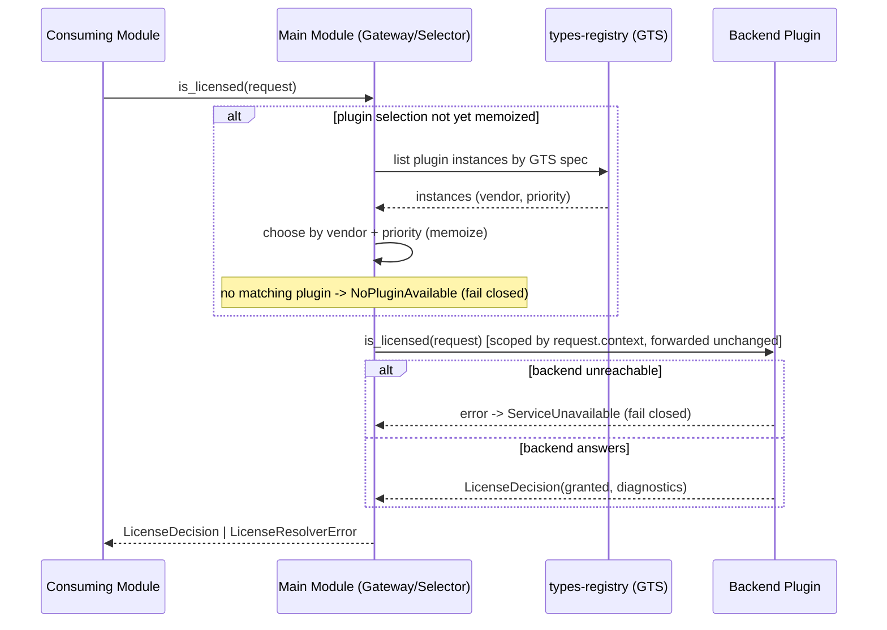

<!-- cpt:
version: 1.0.0
status: draft
module: license-resolver
system: cf
-->

# Technical Design — License Resolver

<!-- toc -->

- [1. Architecture Overview](#1-architecture-overview)
    - [1.1 Architectural Vision](#11-architectural-vision)
    - [1.2 Architecture Drivers](#12-architecture-drivers)
    - [1.3 Architecture Layers](#13-architecture-layers)
- [2. Principles & Constraints](#2-principles--constraints)
    - [2.1 Design Principles](#21-design-principles)
    - [2.2 Constraints](#22-constraints)
- [3. Technical Architecture](#3-technical-architecture)
    - [3.1 Domain Model](#31-domain-model)
    - [3.2 Component Model](#32-component-model)
    - [3.3 API Contracts](#33-api-contracts)
    - [3.4 Internal Dependencies](#34-internal-dependencies)
    - [3.5 External Dependencies](#35-external-dependencies)
    - [3.6 Interactions & Sequences](#36-interactions--sequences)
    - [3.7 Database schemas & tables](#37-database-schemas--tables)
    - [3.8 Deployment Topology](#38-deployment-topology)
- [4. Additional context](#4-additional-context)
- [5. Traceability](#5-traceability)

<!-- /toc -->

- [ ] `p3` - **ID**: `cpt-cf-license-resolver-design-overview`

## 1. Architecture Overview

### 1.1 Architectural Vision

License Resolver is a thin, read-only, plugin-delegating system module. It answers exactly one question — *is this
resource licensed to this subject right now?* — through a single `is_licensed(request)` check, where the
`LicenseCheckRequest` bundles subject, resource, optional evaluation `metadata`, and the tenant context, and returns a
yes/no decision plus a structured, non-authoritative `diagnostics` map (debug info about how the decision was reached).
It owns no grant store: grant facts live in heterogeneous, vendor-owned backends, so the main module discovers and
selects a backend plugin at runtime via the GTS types registry (by vendor + priority) and delegates the lookup. This
mirrors the proven `authz-resolver` / `tenant-resolver` delegation model and keeps issuance, billing, storage, and
catalog/listing concerns out of the resolver.

The architecture is deliberately minimal: a three-crate triad (SDK contract, main-module gateway/selector, backend
plugin) over the ToolKit framework. Resource identity is a single GTS instance id (`GtsInstanceId`) — named (§2.3) or
UUID-based (§2.4) — that encodes resource type + id and references externally-owned resource types (a `feature`, a
`content` item, a capability) without ever defining or validating them — which resource types are licensable and how
they are validated is owned by the backend licensing service. Because the resolver performs no writes and holds no
state, it is stateless and side-effect-free;
the only behavioral guarantees that shape the design are tenant scoping via the request's tenant context (derived from
the caller's `SecurityContext`) and fail-closed semantics when no plugin or backend is reachable.

### 1.2 Architecture Drivers

Requirements from PRD that significantly influence architecture decisions.

#### Functional Drivers

| Requirement                                      | Design Response                                                                                                                                                                                                                                                                  |
|--------------------------------------------------|----------------------------------------------------------------------------------------------------------------------------------------------------------------------------------------------------------------------------------------------------------------------------------|
| `cpt-cf-license-resolver-fr-is-licensed-check`   | A single `is_licensed` method on the public `LicenseResolverClient` contract (`cpt-cf-license-resolver-component-sdk-contract`); the main-module gateway (`cpt-cf-license-resolver-component-main-gateway`) realizes it by delegating to the selected plugin.                    |
| `cpt-cf-license-resolver-fr-subject-identity`    | `Subject` domain entity (subject type + id); carried into the check and propagated to the plugin.                                                                                                                                                                                |
| `cpt-cf-license-resolver-fr-resource-identity`   | Single `GtsInstanceId` resource identity (§3.1; named §2.3 or UUID §2.4); principle `cpt-cf-license-resolver-principle-gts-typed-resource-identity`; the type is derived from the instance id.                                                                                   |
| `cpt-cf-license-resolver-fr-evaluation-metadata` | An opaque `metadata` map (`string`→JSON) on the check input (§3.1, §3.3); the gateway forwards it unchanged to the plugin, which MAY evaluate attribute constraints (region, country, …). The resolver neither interprets nor requires any key — the contract's extension point. |
| `cpt-cf-license-resolver-fr-plugin-delegation`   | Gateway/selector component discovers plugins via the types registry and routes by vendor + priority; principle `cpt-cf-license-resolver-principle-delegate-dont-store`.                                                                                                          |
| `cpt-cf-license-resolver-fr-read-only`           | No write paths, no store, no list method anywhere in the contract; principles `cpt-cf-license-resolver-principle-read-only` and `cpt-cf-license-resolver-principle-check-only-no-listing`.                                                                                       |

#### NFR Allocation

| NFR ID                                       | NFR Summary                                                 | Allocated To                                                        | Design Response                                                                                                                                                                                                                                                                                                                                                                  | Verification Approach                                                                      |
|----------------------------------------------|-------------------------------------------------------------|---------------------------------------------------------------------|----------------------------------------------------------------------------------------------------------------------------------------------------------------------------------------------------------------------------------------------------------------------------------------------------------------------------------------------------------------------------------|--------------------------------------------------------------------------------------------|
| `cpt-cf-license-resolver-nfr-read-latency`   | `is_licensed` ≤ 50ms p95 at the resolver boundary           | Gateway/selector (`cpt-cf-license-resolver-component-main-gateway`) | Plugin instance selection is memoized after first resolution so the hot path is a scoped ClientHub lookup plus one delegated call; boundary excludes plugin compute.                                                                                                                                                                                                             | Boundary latency benchmark at p95 excluding plugin processing.                             |
| `cpt-cf-license-resolver-nfr-fail-closed`    | Never grant by default when no plugin / backend unreachable | Gateway/selector + `LicenseResolverError` mapping                   | No matching plugin yields `NoPluginAvailable`; an unreachable backend yields `ServiceUnavailable`; neither path can produce a granted decision (principle `cpt-cf-license-resolver-principle-fail-closed-no-plugin`).                                                                                                                                                            | Tests asserting 0 grant-by-default outcomes across all no-plugin / unavailable conditions. |
| `cpt-cf-license-resolver-nfr-tenant-scoping` | Every resolution scoped to the request's tenant context     | All components                                                      | Current model: every license is tenant-bounded — regardless of subject type the subject belongs to a tenant. The `LicenseCheckRequest` carries a tenant context (built by the caller from its `SecurityContext`); the gateway scopes by it and forwards the request unchanged to the plugin; tenant scope is derived solely from `request.context` (no cross-tenant resolution). | Tests asserting 0 cross-tenant resolutions.                                                |

#### Key ADRs

| ADR ID                                              | Decision Summary                                                                                                                                                                            |
|-----------------------------------------------------|---------------------------------------------------------------------------------------------------------------------------------------------------------------------------------------------|
| `cpt-cf-license-resolver-adr-gts-resource-identity` | Resource identity is a single `GtsInstanceId` (named §2.3 or UUID §2.4); the resolver references the type — licensable-type catalog and validation belong to the backend licensing service. |
| `cpt-cf-license-resolver-adr-plugin-delegation`     | No resolver-owned store; backend discovered via types-registry and selected by vendor + priority, failing closed when none matches.                                                         |

### 1.3 Architecture Layers

```text
+-----------------------------------------------------------+
|  Consuming module (caller)                                |
| builds LicenseCheckRequest(subject, resource, metadata, ctx)|
+----------------------------+------------------------------+
                             | LicenseResolverClient.is_licensed
                             v
+-----------------------------------------------------------+
|  SDK contract crate  (LicenseResolverClient,              |
|    LicenseResolverPluginClient, DTOs, error enum, GTS)    |
+----------------------------+------------------------------+
                             v
+-----------------------------------------------------------+
|  Main module (gateway / selector)                         |
|    discovers + selects plugin, delegates, maps errors     |
+------------------+----------------------+-----------------+
                   | types-registry (GTS) | scoped ClientHub
                   v                      v
+---------------------------+   +---------------------------+
|  types-registry (GTS)     |   |  Backend plugin           |
|    plugin discovery       |   |    validates + holds      |
|    (vendor + priority)    |   |    grants, answers check  |
+---------------------------+   +---------------------------+
```

- [ ] `p3` - **ID**: `cpt-cf-license-resolver-tech-layers`

| Layer                     | Responsibility                                                            | Technology               |
|---------------------------|---------------------------------------------------------------------------|--------------------------|
| Contract (SDK)            | Public + plugin traits, DTOs, error enum, plugin GTS spec                 | Rust, ToolKit SDK, GTS   |
| Application (main module) | Plugin discovery/selection, delegation, error mapping, tenant propagation | Rust, ToolKit, ClientHub |
| Domain                    | `Subject`, resource `GtsInstanceId`, `LicenseDecision` value types        | Rust, GTS                |
| Integration               | Plugin discovery / selection (vendor + priority)                          | types-registry (GTS)     |

## 2. Principles & Constraints

### 2.1 Design Principles

#### Read-Only / No Issuance

- [ ] `p2` - **ID**: `cpt-cf-license-resolver-principle-read-only`

The resolver only evaluates a check. It never issues, revokes, bills, manages, or stores grants, and its public contract
exposes no such operation. This is a property of the resolver only — a backend plugin behind the delegation boundary may
itself be backed by mutable systems (issuance, billing); how it sources or maintains grants is its own concern. Write
and lifecycle concerns stay out of the resolver, keeping the contract narrow and authoritative.

**ADRs**: `cpt-cf-license-resolver-adr-plugin-delegation`

#### Check-Only / No Listing

- [ ] `p2` - **ID**: `cpt-cf-license-resolver-principle-check-only-no-listing`

The resolver answers a point-in-time question about ONE concrete resource and subject. Enumerating "everything licensed
to a subject" is a catalog/query concern, so there is no list operation and no pagination — there is exactly one
`is_licensed` method.

**ADRs**: `cpt-cf-license-resolver-adr-plugin-delegation`

#### GTS-Typed Resource Identity

- [ ] `p2` - **ID**: `cpt-cf-license-resolver-principle-gts-typed-resource-identity`

Resource identity is a single GTS instance id (`GtsInstanceId`) encoding resource type + id via `~`: a well-known name (
§2.3) or a UUID (§2.4 combined notation). The resolver references externally-owned resource types and never defines or
validates them; which resource types are licensable, and their validation, are owned by the backend licensing service.
The full instance id is passed to that backend, which interprets it.

**ADRs**: `cpt-cf-license-resolver-adr-gts-resource-identity`

#### Delegate, Don't Store

- [ ] `p2` - **ID**: `cpt-cf-license-resolver-principle-delegate-dont-store`

Grant facts live in heterogeneous vendor backends. The main module discovers a backend plugin via the types registry and
delegates the lookup; it holds no grant store of its own, so backends can be added or swapped without caller changes.

**ADRs**: `cpt-cf-license-resolver-adr-plugin-delegation`

#### Fail Closed on No Plugin

- [ ] `p2` - **ID**: `cpt-cf-license-resolver-principle-fail-closed-no-plugin`

When no matching plugin is available or the backend is unreachable, the resolver fails closed: it returns a not-granted
decision or an error and never grants by default. Granting when the authority cannot be reached would be a
license/security violation.

**ADRs**: `cpt-cf-license-resolver-adr-plugin-delegation`

### 2.2 Constraints

#### ToolKit Framework

- [ ] `p2` - **ID**: `cpt-cf-license-resolver-constraint-toolkit-framework`

The module is built on the ToolKit framework and follows the SDK / main-module / plugin triad. Inter-module
communication uses SDK clients and the ClientHub; plugins are consumed only through the main module's public contract,
never directly.

**ADRs**: `cpt-cf-license-resolver-adr-plugin-delegation`

#### GTS via Types Registry

- [ ] `p2` - **ID**: `cpt-cf-license-resolver-constraint-gts-via-types-registry`

Plugin discovery goes exclusively through the GTS types registry: plugins are described by a versioned GTS plugin spec
and selected by vendor + priority. Resource types are referenced by GTS type path; which types are licensable and how
they are validated is owned by the backend licensing service, not the resolver core.

**ADRs**: `cpt-cf-license-resolver-adr-gts-resource-identity`

## 3. Technical Architecture

### 3.1 Domain Model

**Technology**: GTS-typed Rust value types (transport-agnostic SDK models).

**Core Entities**:

| Entity                   | Description                                                                                                                                                                                                                                                                                                                                    |
|--------------------------|------------------------------------------------------------------------------------------------------------------------------------------------------------------------------------------------------------------------------------------------------------------------------------------------------------------------------------------------|
| `LicenseCheckRequest`    | The single input to a check — bundles `subject`, `resource` (`GtsInstanceId`), optional `metadata`, and `context`; the contract's growth surface (new inputs are added as fields, not new parameters).                                                                                                                                         |
| `Subject`                | The "someone" a license is checked for: a subject type plus an id, consistent with the authz-resolver subject model. Polymorphic — a tenant, a user, or any future subject type; not restricted to tenants.                                                                                                                                    |
| resource `GtsInstanceId` | The resource identity: a single GTS instance id encoding type + id via `~`, either a well-known name (§2.3, e.g. `…feature.v1~cf.<vendor>._.somename.v1`) or a UUID (§2.4 combined notation, e.g. `…content.v1~<uuid>`). The full id is passed to the backend plugin, which interprets it.                                                     |
| `Metadata`               | Optional caller-supplied evaluation attributes: a `string`→JSON map, opaque to the core, forwarded unchanged to the plugin for attribute/constraint-based licensing (region, country, environment, …). The contract's extension point; mirrors quota-enforcement request metadata.                                                             |
| `LicenseCheckContext`    | The request's tenant context — the tenant isolation scope, which the caller derives from its `SecurityContext`. Minimal today (tenant scope); reserved for future contextual inputs.                                                                                                                                                           |
| `LicenseDecision`        | The check result: a `granted` boolean plus a `diagnostics` map (string → JSON) of non-authoritative debug info about how the decision was reached (e.g. backend id, matched grant, denial cause). Carrying minimal grant metadata (e.g. status) is a possible future enrichment (PRD §13 open question, §4), not part of the current decision. |

**Resource identity forms** — a single `GtsInstanceId`:

- Named resource (GTS §2.3 well-known instance): the instance segment is a well-known name, e.g.
  `gts.cf.<pkg>.feature.v1~cf.<vendor>._.somename.v1` (the `feature~somename` shorthand).
- Opaque resource (GTS §2.4 anonymous instance): the instance segment is a UUID via the combined notation, e.g.
  `gts.cf.<pkg>.content.v1~<uuid>` (the `content~<uuid>` shorthand).

Both are one `GtsInstanceId`; the backend plugin interprets the concrete instance to answer the check.

**Relationships**:

- `LicenseCheckRequest` is the single input to a check — it bundles `Subject`, the resource `GtsInstanceId`, optional
  `Metadata`, and the `LicenseCheckContext` (tenant scope); `LicenseDecision` is its output.
- The `resource_type` (`GtsTypeId`) derived from the resource instance id is owned by an external module; the resolver
  references it but neither defines nor validates it — the backend licensing service owns the licensable-type catalog
  and its validation.
- There is intentionally NO `Page<T>` and NO `LicensedResource` entity — the resolver does not list or enumerate.

### 3.2 Component Model

```text
            LicenseResolverClient.is_licensed
   caller ------------------------------------> [Main module: gateway/selector]
                                                   |  discovers via types-registry (GTS)
                                                   |  selects by vendor + priority
                                                   v
                              get_scoped::<LicenseResolverPluginClient>
                                                   |
                                                   v
                                          [Backend plugin]
                                            holds grant facts
   (SDK contract crate defines both traits, DTOs, error enum, and the plugin GTS spec)
```

#### SDK Contract

- [ ] `p2` - **ID**: `cpt-cf-license-resolver-component-sdk-contract`

- **Why**: Provides the stable, transport-agnostic contract shared by callers and plugins so neither depends on the
  other's internals.
- **Responsibility scope**: Defines the public `LicenseResolverClient` trait and the `LicenseResolverPluginClient`
  trait (both with the single `is_licensed` method incl. the `metadata` input), the domain DTOs (`Subject`, resource
  `GtsInstanceId`, `Metadata`, `LicenseDecision`), the `LicenseResolverError` enum, the `GtsInstanceId`/`GtsTypeId`
  helpers, and the GTS plugin spec used for discovery.
- **Responsibility boundaries**: Holds no logic, no state, and no plugin selection; defines no resource types (
  externally owned); exposes no listing/enumeration method.
- **Related components**: `cpt-cf-license-resolver-component-main-gateway` — implemented-by (gateway implements the
  public trait); `cpt-cf-license-resolver-component-plugin` — implemented-by (plugin implements the plugin trait).

#### Main-Module Gateway / Selector

- [ ] `p2` - **ID**: `cpt-cf-license-resolver-component-main-gateway`

- **Why**: Realizes the public contract while keeping callers decoupled from any specific backend, centralizing plugin
  discovery, selection, delegation, and fail-closed error mapping.
- **Responsibility scope**: Implements `LicenseResolverClient`; receives a `LicenseCheckRequest`, scopes by its
  `context` (tenant), discovers plugin instances via the plugin GTS spec, selects one by vendor + priority (memoizing
  the selection), resolves the scoped plugin client via ClientHub, propagates the `LicenseCheckRequest` unchanged,
  delegates the `is_licensed` check, and maps plugin/registry failures to the canonical `LicenseResolverError`.
- **Responsibility boundaries**: Owns no grant store and makes no licensing decision itself — it routes; beyond reading
  the tenant scope from `request.context`, does not interpret or validate request fields (the resource instance id and
  `metadata` are passed through to the plugin, which owns resource-type licensability and validation); never grants by
  default (a missing plugin or unreachable backend maps to a non-granting error); performs no listing.
- **Related components**: `cpt-cf-license-resolver-component-sdk-contract` — depends on (implements its public trait);
  `cpt-cf-license-resolver-component-plugin` — calls (delegates the check via the scoped plugin client).

#### Backend Plugin

- [ ] `p2` - **ID**: `cpt-cf-license-resolver-component-plugin`

- **Why**: A license enforcement/management service that encapsulates a vendor-specific source of grant facts behind the
  shared plugin trait so backends are swappable without caller changes.
- **Responsibility scope**: Registers its GTS instance (vendor + priority metadata) and a scoped client; owns the
  catalog of licensable resource types and validates the resource (interpreting the request's resource `GtsInstanceId`,
  named or UUID-based); MAY evaluate the forwarded `metadata` to apply attribute/constraint-based licensing (region,
  country, …); holds/queries grant facts; and answers the delegated `is_licensed` check for the given subject (whatever
  its subject type) within the tenant isolation scope carried in `request.context`.
- **Responsibility boundaries**: Never consumed directly by other modules — only through the main module's public
  contract; does not define the GTS resource types themselves (those are owned by the resources' modules); exposes no
  listing method.
- **Related components**: `cpt-cf-license-resolver-component-sdk-contract` — depends on (implements its plugin trait);
  `cpt-cf-license-resolver-component-main-gateway` — called-by (receives delegated checks).

### 3.3 API Contracts

The module exposes one public client trait and requires one plugin trait, described in prose only (no code).

- **Public interface (PRD)**: `cpt-cf-license-resolver-interface-client`
- **Plugin contract (PRD)**: `cpt-cf-license-resolver-contract-plugin`
- **Technology**: Rust traits over the ToolKit ClientHub (in-process); transport-agnostic SDK models.

**Public client — `LicenseResolverClient`** (realizes PRD `cpt-cf-license-resolver-interface-client`): exposes the
SINGLE method `is_licensed(request: LicenseCheckRequest) -> LicenseDecision`. `LicenseCheckRequest` bundles `subject` (a
`Subject`), `resource` (a `GtsInstanceId`), `metadata` (opaque `string`→JSON evaluation attributes, forwarded to the
plugin), and `context` (a `LicenseCheckContext` carrying the tenant scope). The caller builds `context` from its
`SecurityContext`, exactly as authz-resolver's `PolicyEnforcer` builds an `EvaluationRequest` — the resolver method
itself takes no separate `SecurityContext`. There is no listing or enumeration method.

**Plugin client — `LicenseResolverPluginClient`** (realizes PRD `cpt-cf-license-resolver-contract-plugin`): mirrors the
public signature with the same single `is_licensed` method, discovered via the GTS types-registry plugin spec and
resolved as a scoped client. It tracks the public contract's major version.

**Operation summary**:

| Operation     | Inputs                                                                                | Output                                        | Stability |
|---------------|---------------------------------------------------------------------------------------|-----------------------------------------------|-----------|
| `is_licensed` | `LicenseCheckRequest` (subject, resource `GtsInstanceId`, `metadata`, tenant context) | `LicenseDecision` (granted + diagnostics map) | stable    |

**Error model — `LicenseResolverError`**: the SDK returns this enum; each variant maps to a canonical RFC-9457 error
(`Problem`), so callers get canonical errors directly. Canonical categories and their GTS error type ids come from the
platform error catalog (`toolkit-canonical-errors`).

| Variant                      | Meaning                                              | Canonical error — GTS error type id                                                    |
|------------------------------|------------------------------------------------------|----------------------------------------------------------------------------------------|
| `Unauthorized`               | Caller/subject not permitted to perform the check    | `PermissionDenied` — `gts.cf.core.errors.err.v1~cf.core.err.permission_denied.v1~`     |
| `NoPluginAvailable`          | No backend plugin matches the resource type / vendor | `Internal` — `gts.cf.core.errors.err.v1~cf.core.err.internal.v1~`                      |
| `ServiceUnavailable(reason)` | Selected backend unreachable or erroring             | `ServiceUnavailable` — `gts.cf.core.errors.err.v1~cf.core.err.service_unavailable.v1~` |
| `Internal(reason)`           | Unexpected internal failure                          | `Internal` — `gts.cf.core.errors.err.v1~cf.core.err.internal.v1~`                      |

A negative result is **not** an error — it is `LicenseDecision { granted: false }`. The error enum covers only
"cannot-determine" conditions; on any of them the caller fails closed (treats the outcome as not-granted). Being
read-only, there are no mutation / "not found" write errors.

### 3.4 Internal Dependencies

| Dependency Module   | Interface Used                        | Purpose                                                                             |
|---------------------|---------------------------------------|-------------------------------------------------------------------------------------|
| `types-registry`    | SDK client (`TypesRegistryClient`)    | Discover and select backend plugin instances by GTS plugin spec (vendor + priority) |
| ToolKit `ClientHub` | scoped client registration/resolution | Resolve the selected plugin as a scoped `LicenseResolverPluginClient`               |

**Dependency Rules** (per project conventions):

- No circular dependencies; the main module depends on `types-registry` but not on any plugin crate.
- Always use SDK clients / scoped ClientHub for inter-module communication.
- Plugins are consumed only through the main module's public contract.
- The `LicenseCheckRequest` (including its tenant context) is propagated unchanged across all in-process calls.

### 3.5 External Dependencies

The resolver integrates with no external systems, databases, or third-party services directly. Backend grant sources are
reached only via the discovered plugin component, which is responsible for any external integration it requires. There
is no resolver-owned external dependency.

### 3.6 Interactions & Sequences

#### License Check (is_licensed)

**ID**: `cpt-cf-license-resolver-seq-is-licensed`

**Use cases**: `cpt-cf-license-resolver-usecase-gate-access`

**Actors**: `cpt-cf-license-resolver-actor-consuming-module`, `cpt-cf-license-resolver-actor-backend-plugin`



**Description**: The gateway resolves and memoizes the backend plugin via the types registry (selecting by vendor +
priority), then delegates the single `is_licensed` check, forwarding the `LicenseCheckRequest` unchanged (tenant scope
comes from `request.context`). A missing plugin or unreachable backend fails closed to a non-granting error. No listing
or enumeration sequence exists.

### 3.7 Database schemas & tables

Not applicable because the resolver is read-only and stateless: it owns no grant store and persists nothing. All grant
data lives in the backend plugin.

### 3.8 Deployment Topology

Not applicable because the resolver is read-only and stateless: it is an in-process library module with no dedicated
infrastructure, datastore, or network topology of its own.

## 4. Additional context

**Telemetry**: The resolver's own telemetry surface is minimal — a check counter and a boundary latency histogram.
Dimension them only by bounded labels (the derived resource type, selected vendor, decision outcome); never label by the
full resource instance id or by `metadata` values (unbounded cardinality). Boundary latency excludes plugin compute to
support NFR `cpt-cf-license-resolver-nfr-read-latency`. (Backend plugins' own telemetry is their concern.)

**Future considerations**: The opaque `metadata` map (`cpt-cf-license-resolver-fr-evaluation-metadata`) is the
contract's primary extension point — future attribute/constraint dimensions (region, country, environment, …) are
expressed as new keys interpreted by backends, with no signature change; a conventional key vocabulary MAY be
standardized later, and per-key GTS schema validation is a candidate future addition. Likewise a conventional
`diagnostics` key vocabulary and optional grant metadata (status/expiry) on `LicenseDecision` may be enriched without
changing the single-operation shape. Any such change follows the breaking-change policy on the public contract.

## 5. Traceability

- **PRD**: [PRD.md](./PRD.md)
- **ADRs**: [ADR/](./ADR/)

| PRD ID                                           | Type | DESIGN Section(s)          | Backing ADR                                         |
|--------------------------------------------------|------|----------------------------|-----------------------------------------------------|
| `cpt-cf-license-resolver-fr-is-licensed-check`   | FR   | §1.2, §3.3, §3.6           | `cpt-cf-license-resolver-adr-plugin-delegation`     |
| `cpt-cf-license-resolver-fr-subject-identity`    | FR   | §1.2, §3.1                 | `cpt-cf-license-resolver-adr-gts-resource-identity` |
| `cpt-cf-license-resolver-fr-resource-identity`   | FR   | §1.2, §3.1                 | `cpt-cf-license-resolver-adr-gts-resource-identity` |
| `cpt-cf-license-resolver-fr-evaluation-metadata` | FR   | §1.2, §3.1, §3.3, §3.6, §4 | —                                                   |
| `cpt-cf-license-resolver-fr-plugin-delegation`   | FR   | §1.2, §3.2, §3.4, §3.6     | `cpt-cf-license-resolver-adr-plugin-delegation`     |
| `cpt-cf-license-resolver-fr-read-only`           | FR   | §1.2, §2.1, §3.7           | `cpt-cf-license-resolver-adr-plugin-delegation`     |
| `cpt-cf-license-resolver-nfr-read-latency`       | NFR  | §1.2, §3.2, §4             | `cpt-cf-license-resolver-adr-plugin-delegation`     |
| `cpt-cf-license-resolver-nfr-fail-closed`        | NFR  | §1.2, §2.1, §3.3           | `cpt-cf-license-resolver-adr-plugin-delegation`     |
| `cpt-cf-license-resolver-nfr-tenant-scoping`     | NFR  | §1.2, §3.2, §3.6           | —                                                   |
